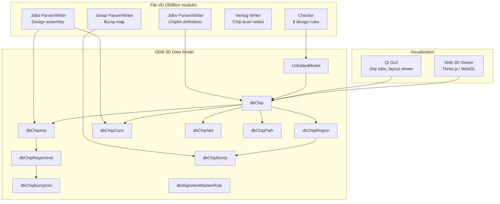
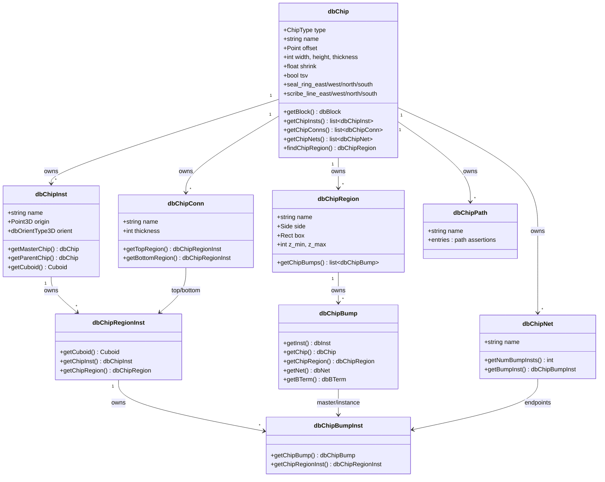

# 3DBlox -- 3D Chiplet Design Support

## Overview

3DBlox is OpenROAD's subsystem for **3D chiplet-based IC packaging design**. It provides:

- A **data model** in OpenDB (ODB) representing chips, chip instances, regions, bumps,
  connections, and nets in three dimensions.
- A set of **file formats** (`.3dbv`, `.3dbx`, `.bmap`) for describing chiplet definitions,
  design assembly, and bump mappings.
- A **design rule checker** that validates physical and logical correctness of a 3D stack.
- **Visualization** in both the Qt GUI and a web-based 3D viewer.
- **Tcl commands** for reading, writing, and checking 3D designs interactively.

The 3DBlox module lives under `src/odb/src/3dblox/` and is built as a library that depends
on `db`, `utl_lib`, `yaml-cpp`, and `OpenSTA`.

## Architecture



## ODB 3D Data Model

The 3D chiplet data model consists of 9 persistent object types defined in JSON schemas
under `src/odb/src/codeGenerator/schema/chip/`. All classes are code-generated and live
in the `odb` namespace.

### Class Hierarchy



### dbChip

The central object representing a physical die, substrate, or hierarchical container.

| Field | Type | Description |
|-------|------|-------------|
| `name` | string | Chip name |
| `type` | ChipType enum | `DIE`, `RDL`, `IP`, `SUBSTRATE`, `HIER` |
| `offset` | Point | Placement offset |
| `width` | int | Chip width (DBU) |
| `height` | int | Chip height (DBU) |
| `thickness` | int | Chip thickness (DBU) |
| `shrink` | float | Shrink factor, range (0, 1] |
| `tsv` | bool | Whether chip uses TSV technology |
| `seal_ring_{east,west,north,south}` | int | Seal ring dimensions (DBU) |
| `scribe_line_{east,west,north,south}` | int | Scribe line dimensions (DBU) |

**ChipType values:**

| Value | Meaning |
|-------|---------|
| `DIE` | A physical silicon die |
| `RDL` | Redistribution layer |
| `IP` | Intellectual property block |
| `SUBSTRATE` | Package substrate |
| `HIER` | Hierarchical container (no physical meaning, groups chiplets) |

**Owned children:** `dbChipInst`, `dbChipRegion`, `dbChipConn`, `dbChipNet`, `dbChipPath`, `dbBlock`, `dbMarkerCategory`.

### dbChipInst

An instance of a master `dbChip` placed inside a parent chip. Supports true 3D placement.

| Field | Type | Description |
|-------|------|-------------|
| `name` | string | Instance name |
| `origin` | Point3D | 3D placement origin (x, y, z in DBU) |
| `orient` | dbOrientType3D | 3D orientation (2D orient + mirror_z) |
| `master_chip` | dbId\<dbChip\> | The master chip this is an instance of |
| `parent_chip` | dbId\<dbChip\> | The parent chip containing this instance |

**Owned children:** `dbChipRegionInst` (one per region in the master chip).

### dbChipRegion

A named region on a chip surface. Regions define areas where bumps can be placed and
where connections can terminate.

| Field | Type | Description |
|-------|------|-------------|
| `name` | string | Region name |
| `side` | Side enum | `FRONT`, `BACK`, `INTERNAL`, `INTERNAL_EXT` |
| `layer` | dbId\<dbTechLayer\> | Associated technology layer |
| `box` | Rect | Bounding box (2D) |
| `z_min` | int | Minimum Z coordinate (DBU) |
| `z_max` | int | Maximum Z coordinate (DBU) |

**Side values:**

| Value | Meaning |
|-------|---------|
| `FRONT` | Front (active) side of the die |
| `BACK` | Back side of the die |
| `INTERNAL` | Internal region (e.g., for TSV connections) |
| `INTERNAL_EXT` | Extended internal region (additional internal area) |

**Owned children:** `dbChipBump`.

### dbChipRegionInst

An instance of a `dbChipRegion` within a `dbChipInst`. When a chip is instantiated, each
of its regions gets a corresponding region instance.

| Field | Type | Description |
|-------|------|-------------|
| `region` | dbId\<dbChipRegion\> | The master region |
| `parent_chipinst` | dbId\<dbChipInst\> | The owning chip instance |

**Owned children:** `dbChipBumpInst`.

### dbChipBump

Associates a physical bump cell (`dbInst`) with a `dbChipRegion` and its electrical
connectivity (`dbNet`, `dbBTerm`).

| Field | Type | Description |
|-------|------|-------------|
| `inst` | dbId\<dbInst\> | Layout instance representing the bump |
| `chip` | dbId\<dbChip\> | The chip this bump belongs to |
| `chip_region` | dbId\<dbChipRegion\> | The region the bump is placed in |
| `net` | dbId\<dbNet\> | Connected net |
| `bterm` | dbId\<dbBTerm\> | Connected block terminal |

### dbChipBumpInst

An instance of a `dbChipBump` within a `dbChipRegionInst`. Links the bump master
definition to its position in the instantiated hierarchy.

| Field | Type | Description |
|-------|------|-------------|
| `chip_bump` | dbId\<dbChipBump\> | The master bump definition |
| `chip_region_inst` | dbId\<dbChipRegionInst\> | The owning region instance |

### dbChipConn

A physical connection between two `dbChipRegionInst` endpoints (top and bottom).
Represents TSV, micro-bump stacks, or other inter-die vertical connections.

| Field | Type | Description |
|-------|------|-------------|
| `name` | string | Connection name |
| `thickness` | int | Connection thickness (DBU) |
| `chip` | dbId\<dbChip\> | The owning chip |
| `top_region` | dbId\<dbChipRegionInst\> | Top endpoint region instance |
| `bottom_region` | dbId\<dbChipRegionInst\> | Bottom endpoint region instance |
| `top_region_path` | vector\<dbId\<dbChipInst\>\> | Hierarchical path to top endpoint |
| `bottom_region_path` | vector\<dbId\<dbChipInst\>\> | Hierarchical path to bottom endpoint |

### dbChipNet

A chip-level net connecting bump instances across the chip hierarchy. Built from
Verilog netlists during `read_3dbx`.

| Field | Type | Description |
|-------|------|-------------|
| `name` | string | Net name |
| `chip` | dbId\<dbChip\> | The owning chip |
| `bump_insts_paths` | vector of (path, bump_inst) pairs | Hierarchical paths to each endpoint bump |

### dbChipPath

A named path assertion for logical connectivity checking. Used by the checker to verify
that expected connectivity paths exist through the chip hierarchy.

| Field | Type | Description |
|-------|------|-------------|
| `name` | string | Path assertion name (e.g., "Path1") |
| `entries` | vector of (path, region_inst, negated) tuples | Entries defining the path through the hierarchy |

Each entry contains a hierarchical path (vector of `dbChipInst` IDs), a target
`dbChipRegionInst`, and a boolean negation flag (prefix with `NOT` in the file format).

### dbAlignmentMarkerRule

Defines alignment checking rules between pairs of master cells (alignment markers)
across chiplet boundaries. Located at `src/odb/src/codeGenerator/schema/dbAlignmentMarkerRule.json`.

| Field | Type | Description |
|-------|------|-------------|
| `lib_a` | dbId\<dbLib\> | First library |
| `master_a` | dbId\<dbMaster\> | First master cell |
| `lib_b` | dbId\<dbLib\> | Second library |
| `master_b` | dbId\<dbMaster\> | Second master cell |
| `rel_orients` | vector\<uint8_t\> | Allowed relative orientations |
| `tolerance` | int | Max center-to-center misalignment (DBU); 0 = exact alignment |

### 3D Geometry Primitives

Defined in `src/odb/include/odb/geom.h`:

**Point3D** -- A 3D integer coordinate.

```cpp
class Point3D {
    int x_, y_, z_;
public:
    Point3D(int x, int y, int z);
    int x() const;
    int y() const;
    int z() const;
};
```

**Cuboid** -- A 3D axis-aligned bounding box with intersection and overlap tests.

```cpp
class Cuboid {
    int xlo_, ylo_, zlo_, xhi_, yhi_, zhi_;
public:
    Cuboid(int x1, int y1, int z1, int x2, int y2, int z2);
    bool intersects(const Cuboid& b) const;  // any overlap
    bool overlaps(const Cuboid& b) const;     // interior overlap
    bool xyIntersects(const Cuboid& b) const; // XY-plane overlap only
    int dx() const, dy() const, dz() const;   // dimensions
    Rect getEnclosingRect() const;             // XY projection
};
```

**dbOrientType3D** -- A 3D orientation combining a 2D orientation with a Z-mirror flag.
Defined in `src/odb/include/odb/dbTypes.h`.

```cpp
class dbOrientType3D {
    dbOrientType::Value value_{dbOrientType::R0};
    bool mirror_z_{false};
public:
    dbOrientType3D(const dbOrientType& orient, bool mirror_z);
    std::string getString() const;           // e.g., "MZ", "MZ_R90", "MX_MZ"
    dbOrientType getOrientType2D() const;
    bool isMirrorZ() const;
};
```

Standard 2D orientations (`R0`, `R90`, `R180`, `R270`, `MX`, `MY`, `MX_R90`, `MY_R90`)
are extended with an `MZ` prefix for Z-mirrored variants (e.g., `MZ`, `MZ_R90`,
`MZ_MX`, `MZ_MY_R180`).

### UnfoldedModel

The `UnfoldedModel` class (`src/odb/include/odb/unfoldedModel.h`) flattens the
hierarchical chip/instance/region/bump structure into a flat representation with
**global 3D coordinates**. This is used by the checker and visualization layers.

```cpp
class UnfoldedModel {
public:
    UnfoldedModel(utl::Logger* logger, dbChip* chip);
    const std::deque<UnfoldedChip>& getChips() const;
    const std::vector<UnfoldedConnection>& getConnections() const;
    const std::vector<UnfoldedNet>& getNets() const;
};
```

Key structures in the unfolded model:

| Structure | Description |
|-----------|-------------|
| `UnfoldedChip` | A chip instance with global `Cuboid`, `dbTransform`, list of regions and alignment markers |
| `UnfoldedRegion` | A region with global `Cuboid`, effective side (TOP/BOTTOM/INTERNAL/INTERNAL_EXT), and bumps |
| `UnfoldedBump` | A bump with global `Point3D` position |
| `UnfoldedConnection` | A connection linking two unfolded regions |
| `UnfoldedNet` | A net with pointers to connected unfolded bumps |
| `UnfoldedAlignmentMarker` | An alignment marker instance with global position |

To build the unfolded model:

```tcl
set chip [ord::get_db_chip]
set model [$chip constructUnfoldedModel]
```

### Database-Level Access

`dbDatabase` provides global accessors for 3D objects:

```cpp
// Iterate all chips
dbSet<dbChip> getChips() const;
dbChip* findChip(const char* name) const;

// Set/get the top-level chip
void setTopChip(dbChip* chip);
dbChip* getChip() const;

// Global iterators
dbSet<dbChipInst> getChipInsts() const;
dbSet<dbChipRegionInst> getChipRegionInsts() const;
dbSet<dbChipConn> getChipConns() const;
dbSet<dbChipBumpInst> getChipBumpInsts() const;
dbSet<dbChipNet> getChipNets() const;

// Build the unfolded model
UnfoldedModel* constructUnfoldedModel();
UnfoldedModel* getUnfoldedModel() const;
```

## 3DBlox File Formats

3DBlox uses three file formats based on YAML (parsed with `yaml-cpp`) and a simple
space-delimited text format.

### .3dbv -- Chiplet Definition File

Defines chiplet master templates. Each chiplet specifies its type, geometry, regions,
and references to external design files (LEF, DEF, Verilog, Liberty).

**Structure:**

```yaml
#!define VARIABLE_NAME path/to/dir    # Preprocessor variable definition

Header:
  version: <float>                    # Format version
  unit: <string>                      # Unit (e.g., "micron")
  precision: <int>                    # DBU precision (units per micron)

ChipletDef:
  <chiplet_name>:
    type: <die|rdl|ip|substrate|hier>
    design_area: [<width>, <height>]
    shrink: <float>                   # Range (0, 1]
    tsv: <true|false>
    thickness: <float>                # In specified units
    offset: [<x>, <y>]
    seal_ring:
      left: <float>
      bottom: <float>
      right: <float>
      top: <float>
    scribe_line:
      left: <float>
      bottom: <float>
      right: <float>
      top: <float>
    regions:
      <region_name>:
        side: <front|back|internal|internal_ext>
        coords:                       # Polygon vertices
          - [<x>, <y>]
          - [<x>, <y>]
          - ...
        bmap: <path/to/file.bmap>    # Optional bump map
        pmap: <path/to/file.pmap>    # Optional pin map
        layer: <tech_layer_name>     # Optional tech layer
    external:
      APR_tech_file: [<lef_tech_files>]
      liberty_file: [<lib_files>]
      LEF_file: [<lef_files>]
      DEF_file: <def_file>
      verilog_file: <verilog_file>
```

**Example** (from `src/odb/test/data/example.3dbv`):

```yaml
#!define NG45_PATH ../Nangate45

Header:
  version: 2.5
  unit: micron
  precision: 2000

ChipletDef:
  SoC:
    type: die
    design_area: [955, 1082]
    shrink: 1
    tsv: false
    thickness: 300
    offset: [0, 0]
    regions:
      front_reg:
        side: front
        coords:
          - [0, 0]
          - [955, 0]
          - [955, 1082]
          - [0, 1082]
      back_reg:
        side: back
        coords:
          - [0, 0]
          - [955, 0]
          - [955, 1082]
          - [0, 1082]
        bmap: example.bmap
        layer: metal1
    external:
      APR_tech_file: [NG45_PATH/*_tech.lef]
      liberty_file: [NG45_PATH/fake_macros.lib]
      LEF_file: [NG45_PATH/fake_macros.lef, NG45_PATH/fake_bumps.lef]
      DEF_file: ../fake_macros.def
```

### .3dbx -- Design Assembly File

Defines the top-level design, instantiates chiplets, specifies their 3D stacking
layout, and defines inter-chiplet connections.

**Structure:**

```yaml
Header:
  version: <string>
  unit: <string>
  precision: <int>
  include:                              # References to .3dbv files
    - <path/to/file.3dbv>

Design:
  name: <design_name>
  external:
    verilog_file: <top_verilog_file>

ChipletInst:
  <instance_name>:
    reference: <chiplet_def_name>       # Must match a ChipletDef name
    external:
      verilog_file: <instance_verilog>
      sdc_file: <timing_constraints>
      def_file: <instance_def>

Stack:
  <instance_name>:
    loc: [<x>, <y>]                     # 2D placement location
    z: <float>                          # Z offset (stacking height)
    orient: <R0|R90|R180|R270|MX|MY|...>  # 3D orientation

Connection:
  <connection_name>:
    top: <inst_name>.regions.<region>   # Top endpoint (or ~ for none)
    bot: <inst_name>.regions.<region>   # Bottom endpoint (or ~ for none)
    thickness: <float>

Path:
  <path_name>:                          # Path assertions for logical checking
    - <inst_name>.regions.<region>
    - NOT <inst_name>.regions.<region>  # Negated entry
```

**Example** (from `src/odb/test/data/example.3dbx`):

```yaml
Header:
  version: "1.0"
  unit: "micron"
  precision: 2000
  include:
    - example.3dbv

Design:
  name: "TopDesign"
  external:
    verilog_file: "top.v"

ChipletInst:
  soc_inst:
    reference: SoC
    external:
      verilog_file: "soc.v"
      sdc_file: "/path/to/soc.sdc"
      def_file: "/path/to/soc.def"
  soc_inst_duplicate:
    reference: SoC
    external:
      verilog_file: "soc.v"
      sdc_file: "/path/to/soc.sdc"
      def_file: "/path/to/soc.def"

Stack:
  soc_inst:
    loc: [100.0, 200.0]
    z: 0.0
    orient: R0
  soc_inst_duplicate:
    loc: [100.0, 200.0]
    z: 300.0
    orient: MZ

Connection:
  soc_to_soc:
    top: soc_inst_duplicate.regions.front_reg
    bot: soc_inst.regions.front_reg
    thickness: 0.0
  soc_to_virtual:
    top: soc_inst.regions.back_reg
    bot: ~                              # No bottom endpoint (virtual)
    thickness: 0.0
```

This example defines a two-die stack: `soc_inst` at Z=0 and `soc_inst_duplicate` at
Z=300 with Z-mirror orientation. The `soc_to_soc` connection links the front regions
of both dies.

### .bmap -- Bump Map File

A simple space-delimited text format mapping bumps to their physical locations and
electrical connections.

**Format:**

```
<bump_name> <BUMP_TYPE> <x> <y> <port_name|-|> <net_name|-|>
```

**Example** (from `src/odb/test/data/example.bmap`):

```
bump1 BUMP 100.0 200.0 - -
bump2 BUMP 150.0 200.0 - -
```

Fields:
- `bump_name`: Name of the bump instance
- `BUMP_TYPE`: Cell type (e.g., `BUMP`)
- `x`, `y`: Coordinates in the region's coordinate system
- `port_name`: Port name on the bump cell, or `-` for auto-detect
- `net_name`: Net name to connect, or `-` for auto-detect

## Tcl Commands

### read_3dbv

Read a `.3dbv` chiplet definition file. Creates `dbChip` master objects in the database.

```tcl
read_3dbv <filename>
```

| Parameter | Description |
|-----------|-------------|
| `filename` | Path to the `.3dbv` file |

### read_3dbx

Read a `.3dbx` design assembly file. Creates chip instances, connections, and builds
chip-level nets from the Verilog netlist.

```tcl
read_3dbx <filename>
```

| Parameter | Description |
|-----------|-------------|
| `filename` | Path to the `.3dbx` file |

This command also processes any `include` directives in the `.3dbx` header, reading
referenced `.3dbv` files automatically.

### read_3dblox_bmap

Read a `.bmap` bump map file and associate bumps with a chip region.

```tcl
read_3dblox_bmap <filename>
```

| Parameter | Description |
|-----------|-------------|
| `filename` | Path to the `.bmap` file |

### check_3dblox

Run the 3D design rule checker on the current database. Violations are reported as
markers in `dbMarkerCategory`.

```tcl
check_3dblox
```

### write_3dbv

Write chiplet definitions from the database to a `.3dbv` file.

```tcl
write_3dbv <filename>
```

| Parameter | Description |
|-----------|-------------|
| `filename` | Output path for the `.3dbv` file |

### write_3dbx

Write the design assembly from the database to a `.3dbx` file.

```tcl
write_3dbx <filename>
```

| Parameter | Description |
|-----------|-------------|
| `filename` | Output path for the `.3dbx` file |

### add_3dblox_alignment_marker_rule

Add an alignment marker rule for checking marker cell pairs across chiplet boundaries.

```tcl
add_3dblox_alignment_marker_rule \
    -lib_a <lib_name> \
    -master_a <master_name> \
    -lib_b <lib_name> \
    -master_b <master_name> \
    -tolerance <dbu_value> \
    -relative_orientations <orient_list>
```

| Option | Description |
|--------|-------------|
| `-lib_a` | Library name for the first marker cell |
| `-master_a` | Master cell name for the first marker |
| `-lib_b` | Library name for the second marker cell |
| `-master_b` | Master cell name for the second marker |
| `-tolerance` | Max center-to-center misalignment in DBU (0 = exact) |
| `-relative_orientations` | List of allowed relative orientations |

## Design Rule Checker

The checker (`src/odb/src/3dblox/checker.cpp`) validates the 3D design after reading
the 3DBlox files. It builds an `UnfoldedModel` and performs 8 checks. Violations are
reported as `dbMarker` objects under `dbMarkerCategory`.

### Floating Chip Detection

`checkFloatingChips` -- Identifies chips that are not vertically connected to any other
chip or to ground. A chip is "floating" if it has no connection path to another chip
through shared region connections.

### Overlapping Chip Detection

`checkOverlappingChips` -- Detects chips whose 3D bounding boxes (`Cuboid`) overlap
in XYZ space. Two chips at the same Z level with overlapping XY footprints are flagged.

### Internal Extended Region Usage

`checkInternalExtUsage` -- Verifies that `INTERNAL_EXT` regions are actually used by
at least one connection. Unused internal extended regions may indicate a design error.

### Connection Region Validation

`checkConnectionRegions` -- Validates that connection endpoints reference valid regions.
Checks that the top and bottom region instances of each `dbChipConn` exist and are
properly formed.

### Bump Physical Alignment

`checkBumpPhysicalAlignment` -- Verifies that each bump's physical location falls within
its parent region's bounding box. Bumps placed outside their region are flagged.

### Net Connectivity

`checkNetConnectivity` -- Checks chip-level net connectivity. Verifies that `dbChipNet`
objects have valid endpoint paths and that all referenced bump instances exist.

### Alignment Marker Checking

`checkAlignmentMarkers` -- Validates alignment between marker cell pairs defined by
`dbAlignmentMarkerRule`. Checks that paired markers are within the specified tolerance
and have acceptable relative orientations.

### Logical Connectivity

`checkLogicalConnectivity` -- Validates path assertions defined by `dbChipPath`. Each
path assertion specifies a sequence of hierarchical region references (with optional
negation) that must or must not be connected.

## Visualization

### Qt GUI

The Qt desktop GUI has chip-aware rendering:

- **Chip tabs**: When a 3DBlox design is loaded (`postRead3Dbx` callback), the GUI
  creates separate layout tabs for each chip in the hierarchy.
- **Chip navigation**: `setChip()` switches the active chip for layout viewing,
  search, and display controls.
- **DRC integration**: The DRC widget is chip-aware, showing violations in the context
  of the selected chip.
- **Rendering**: The render thread traverses the chip hierarchy and draws chip instances
  with their transforms.

### Web 3D Viewer

The web interface includes a Three.js-based 3D chiplet viewer (`src/web/src/3d-viewer-widget.js`):

- **WebGL rendering**: Uses Three.js `WebGLRenderer` with perspective camera.
- **Chiplet visualization**: Each chip is rendered as a 3D box with distinct color
  (10-color palette), positioned at its Z offset.
- **Interactive features**:
  - Rotation, panning, and zooming via mouse
  - Hover tooltips showing chiplet name and dimensions (raycasting-based)
  - Grid and axis reference lines
  - True-Z toggle for proportional vs. exaggerated Z scaling
- **DRC violations**: Violation markers blink in the 3D view.
- **Data endpoint**: The `get_3d_data` WebSocket endpoint extracts chip hierarchy data
  as JSON for the frontend.

## Integration Points

### DEF Reader

The `defin` module accepts an optional `dbChip*` parameter, allowing DEF files to be
read into a specific chip context:

```cpp
defin reader(db);
reader.createChipBlocks(chip, lef_reader, def_file, ...);
```

This is used by the 3DBlox module to load each chiplet's DEF into its corresponding
`dbChip` block.

### PSM (Power Stripe Manager)

The IR drop heat map data source is chip-aware:

```cpp
IRDropDataSource::setChip(dbChip* chip);
```

When set, the heat map operates in the context of the specified chip.

### UnfoldedModel Consumers

The `UnfoldedModel` is consumed by:
- The design rule checker (all 8 checks)
- The web 3D viewer (via the `get_3d_data` endpoint)
- Any custom analysis that needs global 3D coordinates

## Current Limitations

The following modules do **not** have 3D chiplet awareness:

| Module | Status |
|--------|--------|
| STA (Static Timing Analysis) | No 3D timing support |
| DFT (Design for Test) | No 3D awareness |
| PDN (Power Distribution Network) | No 3D awareness |
| GRT (Global Routing) | No 3D awareness |
| DPL (Detailed Placement) | No 3D awareness |
| CTS (Clock Tree Synthesis) | No 3D awareness |

The 3D support is currently concentrated in the **data model and verification layers**,
not in the physical implementation flow (placement, routing, timing).

## Test Coverage

### Tcl Tests

| Test | Description |
|------|-------------|
| `src/odb/test/read_3dbv.tcl` | Read `.3dbv`, verify chip exists |
| `src/odb/test/read_3dbx.tcl` | Read `.3dbx`, verify chip exists |
| `src/odb/test/write_3dbv.tcl` | Round-trip: read `.3dbx`, write `.3dbv`, diff |
| `src/odb/test/write_3dbx.tcl` | Round-trip: read `.3dbx`, write `.3dbx`, diff |
| `src/odb/test/check_3dblox.tcl` | Checker: floating chips, overlaps, touching chips |

### C++ Tests

| Test | Description |
|------|-------------|
| `TestChips.cpp` | Chip hierarchy creation (nested: cache in CPU in system) |
| `Test3DBloxParser.cpp` | `.3dbv` and `.3dbx` parsing verification |
| `Test3DBloxChecker.cpp` | Checker: no violations, overlapping, floating chips |
| `Test3DBloxCheckerBumps.cpp` | Bump alignment: inside/outside region |
| `Test3DBloxCheckerLogicalConn.cpp` | Logical connectivity with bump nets |
| `Test3DBloxCheckerAlignmentMarkers.cpp` | Alignment marker rules with tolerance |
| `Test3DBloxVerilogWriter.cpp` | Verilog writer for chip-level nets |
| `TestWriteReadDbHier.cpp` | Serialization/deserialization of hierarchical DB |

### Test Data

| File | Description |
|------|-------------|
| `src/odb/test/data/example.3dbv` | Sample chiplet definition (SoC die) |
| `src/odb/test/data/example.3dbx` | Sample design assembly (two-die stack) |
| `src/odb/test/data/example.bmap` | Sample bump map |

## Source File Reference

| Path | Description |
|------|-------------|
| `src/odb/include/odb/3dblox.h` | Public API (`ThreeDBlox` class) |
| `src/odb/include/odb/db.h` | 3D object APIs (lines 7122-7560) |
| `src/odb/include/odb/geom.h` | `Point3D`, `Cuboid` |
| `src/odb/include/odb/dbTypes.h` | `dbOrientType3D` |
| `src/odb/include/odb/unfoldedModel.h` | `UnfoldedModel` |
| `src/odb/src/3dblox/` | Parsers, writers, checker |
| `src/odb/src/codeGenerator/schema/chip/` | JSON schemas (10 files) |
| `src/odb/src/db/dbChip.cpp` | `dbChip` implementation |
| `src/odb/src/db/unfoldedModel.cpp` | `UnfoldedModel` implementation |
| `src/OpenRoad.tcl` | Tcl command wrappers (lines 170-237) |
| `src/web/src/3d-viewer-widget.js` | Web 3D viewer |
