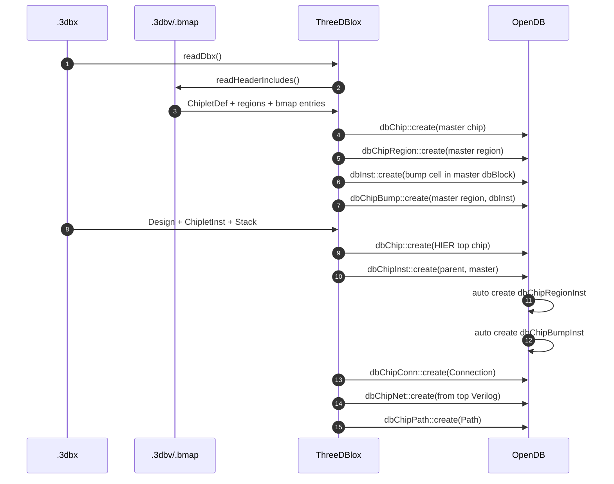
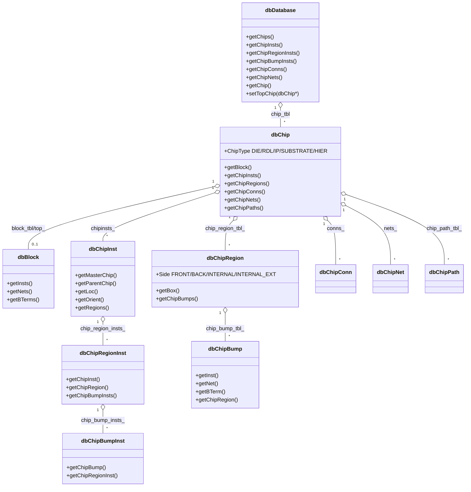
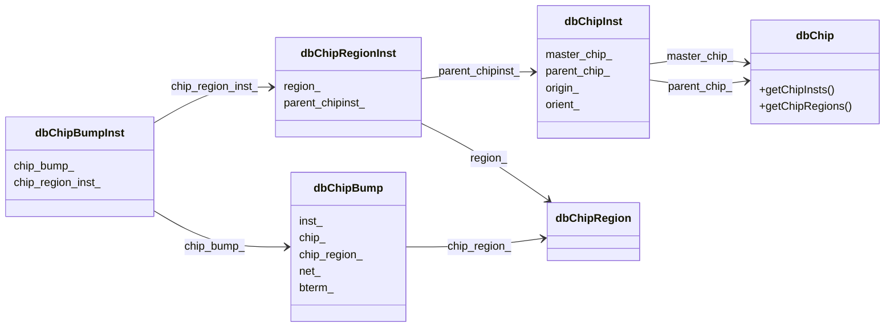
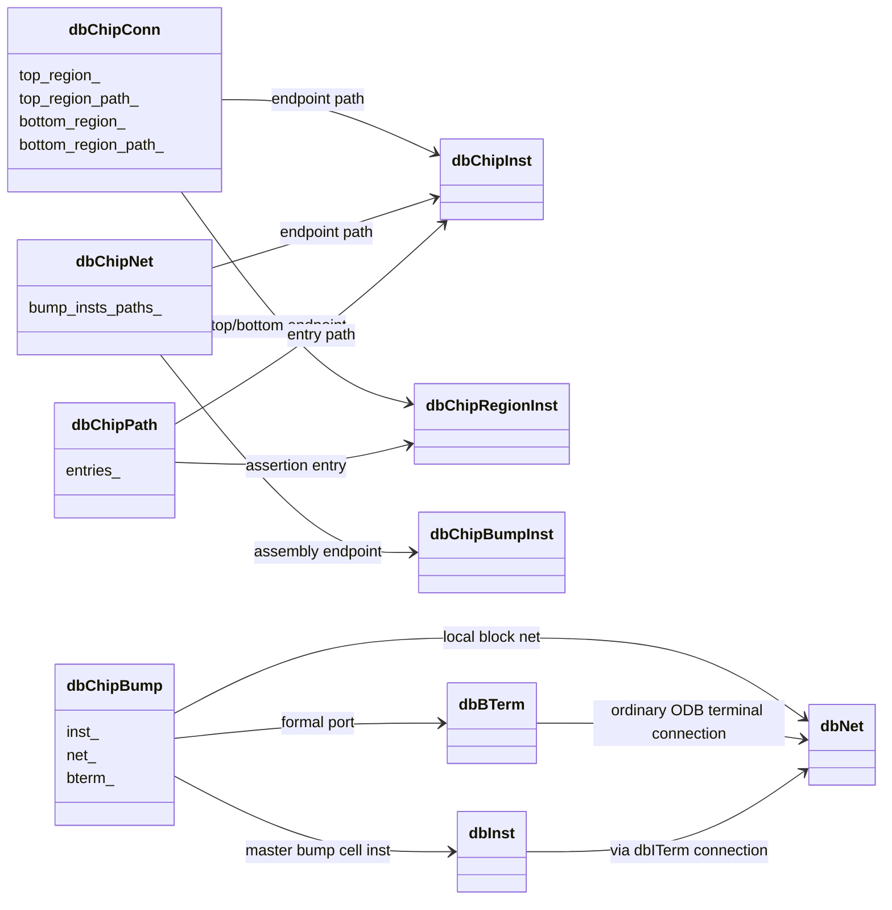
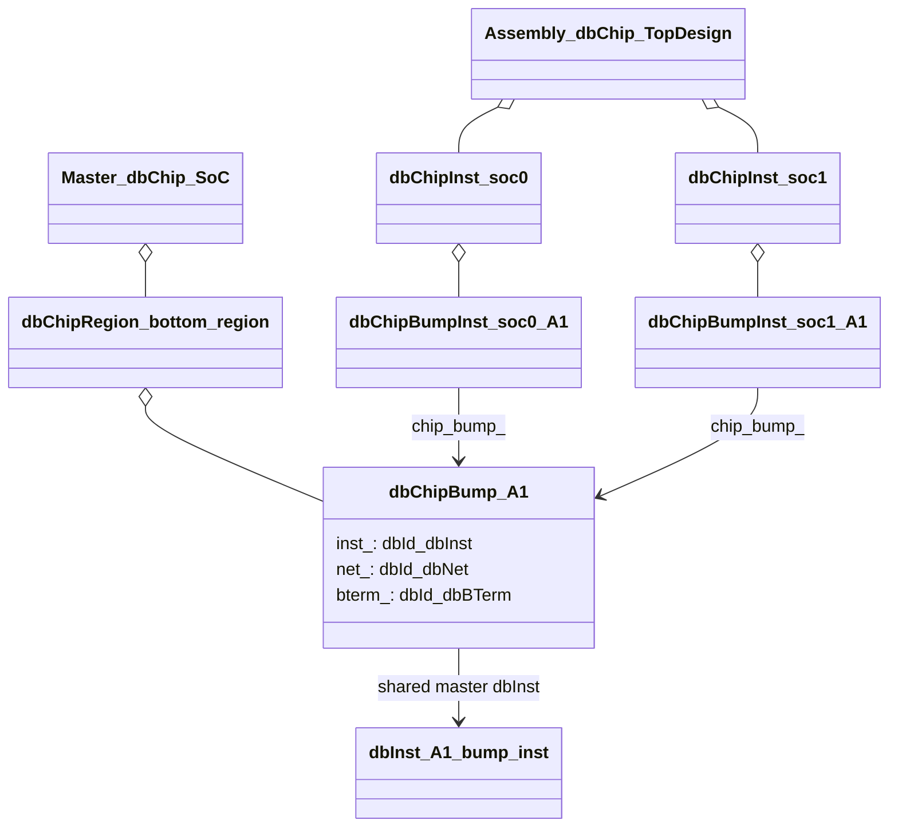

# 3DBlox 相关 ODB 对象关系

本文整理 OpenROAD/OpenDB 中和 3DBlox 相关的 ODB 对象，说明它们的职责、
创建来源、对象之间的 ownership/reference 关系，以及当前 bump 建模的语义边界。

相关对象主要位于 `src/odb/include/odb/db.h`，字段 schema 位于
`src/odb/src/codeGenerator/schema/chip/`。

配套的静态 HTML 可视化页面见：
`docs/data_model/3DIC/3Dblox/odb_objects_visualization.html`。

## 阅读指南

3DBlox ODB 对象最容易混淆的地方，是同一个概念会同时出现在三个层级：

| 层级 | 代表对象 | 语义 |
| --- | --- | --- |
| Master definition | `dbChip`、`dbChipRegion`、`dbChipBump`、`dbBlock`、`dbInst` | chiplet 定义本身，来自 `.3dbv` / `.bmap` |
| Assembly occurrence | `dbChipInst`、`dbChipRegionInst`、`dbChipBumpInst`、`dbChipConn`、`dbChipNet` | 顶层或层次化装配中的实例化 occurrence，来自 `.3dbx` |
| Unfolded view | `UnfoldedChip`、`UnfoldedRegion`、`UnfoldedBump`、`UnfoldedNet` | 检查器使用的展开后坐标/连接视图，不是持久化 schema |

因此阅读时建议始终先判断对象属于哪一层：

- `dbChipBump` 指向的是 master chiplet 中的 bump entry。
- `dbChipBumpInst` 指向某个 chip instance 下的 bump occurrence，但仍引用 master
  `dbChipBump`。
- `dbNet` 是 chiplet block 内部 net。
- `dbChipNet` 是 assembly 层面的 chip-level net。
- `dbBTerm` 是 chiplet/block 的 formal port；`dbITerm` 是具体 `dbInst` 的 instance pin。

下面的文档把关系分成两类描述：

- **Ownership/container**：对象存在哪个 table/list 中，生命周期通常跟随谁。
- **Reference/cross-link**：对象字段指向谁，用来表达 master/occurrence、net endpoint、
  connection endpoint 等语义。

## 对象总览

3DBlox 在 ODB 中围绕 `dbChip` 扩展出一组 chip-level 对象：

| 对象 | 主要语义 | 通常来自 |
| --- | --- | --- |
| `dbChip` | 一个 chiplet、die、RDL、substrate 或 HIER 顶层装配 | `.3dbv` `ChipletDef`，`.3dbx` `Design` |
| `dbChipInst` | 在 parent chip 中实例化一个 child/master chip | `.3dbx` `ChipletInst` + `Stack` |
| `dbChipRegion` | master chip 上的连接区域，带 side、box、layer | `.3dbv` `regions` |
| `dbChipRegionInst` | `dbChipInst` 下的 region occurrence | `dbChipInst::create()` 自动创建 |
| `dbChipBump` | master chip region 上的 bump entry，当前绑定 master block 中的 `dbInst` | `.bmap` 行 |
| `dbChipBumpInst` | `dbChipInst` 下的 bump occurrence/reference | `dbChipInst::create()` 自动创建 |
| `dbChipConn` | parent chip 内两个 region occurrence 之间的物理/堆叠连接 | `.3dbx` `Connection` |
| `dbChipNet` | parent/HIER chip 层面的逻辑 net，连接多个 bump occurrence | 顶层 Verilog |
| `dbChipPath` | path assertion，记录一组 region path 和 negation | `.3dbx` `Path` |

普通 ODB 对象也参与 3DBlox bump 建模：

| 对象 | 在 3DBlox 中的作用 |
| --- | --- |
| `dbBlock` | 非 HIER chip 的传统 block 视图，保存 `dbInst`、`dbNet`、`dbBTerm` |
| `dbInst` | bump cell 或 alignment marker 等 block 内实例 |
| `dbMaster` | bump cell、macro、standard cell 的几何模板 |
| `dbNet` | chiplet/block 内部 net，连接 `dbBTerm` 和 bump cell `dbITerm` |
| `dbBTerm` | chiplet/block 对外 formal port，可通过 `getChipBump()` 找回 bump |
| `dbITerm` | `dbInst` 的实例端口，例如 bump cell 的 PAD pin |

## 输入到对象的映射

```text
.3dbv ChipletDef
  -> dbChip(type=DIE/RDL/IP/SUBSTRATE/HIER)
  -> dbBlock, if DEF is read or blackbox block is created
  -> dbChipRegion
  -> .bmap
       -> dbInst bump cell
       -> dbChipBump
       -> optional dbNet / dbBTerm / dbITerm connection

.3dbx Design
  -> top dbChip(type=HIER)
  -> dbDatabase::setTopChip()

.3dbx ChipletInst + Stack
  -> dbChipInst
       -> auto dbChipRegionInst for each master dbChipRegion
       -> auto dbChipBumpInst for each master dbChipBump

.3dbx Connection
  -> dbChipConn

.3dbx Design.external.verilog_file
  -> dbChipNet
       -> dbChipBumpInst endpoints with chip instance paths

.3dbx Path
  -> dbChipPath
```

## 创建时序 UML

先看对象创建顺序，可以避免把 master definition 和 assembly occurrence 混淆。



## Ownership UML

下面是对象的主要 ownership/container 关系。需要注意：部分对象的底层 table 在
`dbDatabase` 中，但同时会挂入 parent chip 或 parent occurrence 的链表。下图表达的是工具使用时
最常见的逻辑 containment，而不是每个 `dbTable` 的物理存放位置。



## Core Reference UML

下面只画 chip、region、bump 的 master/occurrence 关系。箭头不是 ownership，而是对象字段保存的
引用。



## Connectivity Reference UML

下面单独画连接关系，避免把 `dbNet` 和 `dbChipNet` 混为同一层级。



## Bump Master/Occurrence UML

下面的图专门强调：`dbChipBumpInst` 只保存 occurrence 引用，本身没有 `dbInst` 字段。



## dbChip

`dbChip` 是 3DBlox 的核心对象。它既可以表示物理 chiplet，也可以表示装配层级。

类型：

- `DIE`
- `RDL`
- `IP`
- `SUBSTRATE`
- `HIER`

关键属性：

- `name_`：chip 名称。
- `type_`：chip 类型。
- `offset_`：chiplet-local offset。
- `width_`、`height_`、`thickness_`：三维尺寸，单位为 DBU。
- `shrink_`、`tsv_`、seal ring、scribe line：chiplet 物理属性。
- `tech_`：关联 `dbTech`。
- `top_` / `block_tbl_`：传统 block 视图。
- `chipinsts_`：child chip instance 链表。
- `conns_`：该 chip 层级内的 `dbChipConn`。
- `nets_`：该 chip 层级内的 `dbChipNet`。
- `chip_path_tbl_`：该 chip 上的 `dbChipPath`。

在 `.3dbv` 中，`ChipletDef` 会创建普通 chiplet `dbChip`。在 `.3dbx` 中，
`Design` 会创建顶层 `HIER` chip，并调用 `dbDatabase::setTopChip()`。

## dbChipInst

`dbChipInst` 表示在一个 parent `dbChip` 中实例化另一个 master `dbChip`。

关键字段：

- `name_`：实例名。
- `origin_`：3D 位置，来自 `.3dbx` `Stack.loc` 和 `Stack.z`。
- `orient_`：3D 朝向。
- `master_chip_`：被实例化的 master chip。
- `parent_chip_`：该 instance 所属 parent chip。
- `chip_region_insts_`：自动创建的 region occurrence 链表。
- `region_insts_map_`：master region 到 region occurrence 的映射。

创建 `dbChipInst` 时会自动做两件事：

1. 遍历 master chip 的所有 `dbChipRegion`，创建对应 `dbChipRegionInst`。
2. 遍历每个 master region 的所有 `dbChipBump`，创建对应 `dbChipBumpInst`。

因此，一个 master chip 被实例化多次时，每个 `dbChipInst` 都有独立的
`dbChipRegionInst` 和 `dbChipBumpInst` occurrence；但这些 occurrence 会引用同一套
master `dbChipRegion` / `dbChipBump` definition。

## dbChipRegion 与 dbChipRegionInst

`dbChipRegion` 是 master chip 上的连接区域。它来自 `.3dbv` `regions`。

关键字段：

- `name_`：region 名称。
- `side_`：`FRONT`、`BACK`、`INTERNAL`、`INTERNAL_EXT`。
- `layer_`：可选技术层。
- `box_`：region 的 2D bbox。
- `z_min_` / `z_max_`：region z 范围。

`dbChipRegionInst` 是 region 在某个 `dbChipInst` 下的 occurrence：

- `region_`：指向 master `dbChipRegion`。
- `parent_chipinst_`：所属 `dbChipInst`。
- `chip_bump_insts_`：该 region occurrence 下的 bump occurrence。

region 的方向和位置在展开模型中会结合 `dbChipInst` 的 3D transform 计算。比如 master
region 是 `FRONT`，如果 chip instance 有 Z mirror，展开后 effective side 可能被翻转。

## dbChipBump 与 dbChipBumpInst

当前 ODB 中 bump 是 master/occurrence 两层：

```text
dbChipBump
  = master chip region 上的 bump entry
  = 当前实现中绑定 master block 内的 dbInst/dbNet/dbBTerm

dbChipBumpInst
  = 某个 dbChipInst / dbChipRegionInst 下的 bump occurrence
  = 指向 master dbChipBump
```

更直白地说：

```text
.bmap row
  -> master chiplet 内的 dbChipBump
  -> 当前还会物化为 master dbBlock 内的 dbInst

dbChipInst::create()
  -> 为每个 master dbChipBump 创建一个 dbChipBumpInst occurrence
```

这意味着 `.bmap` 行不是 top assembly 中某个具体 `dbChipInst` 的专属 bump。它是
chiplet definition 的一部分。若同一个 chiplet master 被实例化两次，会得到两个
`dbChipBumpInst` occurrence，但它们都引用同一个 master `dbChipBump`。

`dbChipBump` 字段：

- `inst_`：master chip `dbBlock` 中的 bump cell `dbInst`。
- `chip_`：所属 master `dbChip`。
- `chip_region_`：所属 master `dbChipRegion`。
- `net_`：master block 中的 local `dbNet`。
- `bterm_`：master block 中的 formal `dbBTerm`。

`dbChipBumpInst` 字段：

- `chip_bump_`：指向 master `dbChipBump`。
- `chip_region_inst_`：所属 `dbChipRegionInst`。
- `region_next_`：region occurrence 内的链表指针。

### Bump 的普通 ODB 连接关系

`.bmap` 行会在 `ThreeDBlox::createBump()` 中创建或绑定：

```text
dbChipBump
  -> dbInst bump cell
  -> dbNet local net
  -> dbBTerm formal port
```

同时调用普通 ODB 连接 API：

```text
dbBTerm <--> dbNet <--> bump cell dbITerm
```

其中：

- `dbBTerm` 是 block/chip 的对外端口。
- `dbITerm` 是 bump cell `dbInst` 的实例端口。
- `dbChipBump` 自身不是普通 `dbNet` 的 terminal，它只是额外保存 bump 语义关联。

单个 master chiplet 内的关系如下：

```text
dbBTerm(formal port) ----+
                         |
                      dbNet(local block net)
                         |
dbITerm(bump cell pin) --+
  ^
  |
dbInst(bump cell)

dbChipBump
  -> dbBTerm
  -> dbNet
  -> dbInst
  -> dbChipRegion
```

`dbChipBump::setNet()` 和 `dbChipBump::setBTerm()` 本身不完整维护上面的普通 ODB
连接一致性。当前 `.bmap` 读入时由 `ThreeDBlox::createBump()` 显式调用
`dbITerm::connect(net)` 和 `dbBTerm::connect(net)` 补齐。

### 多实例场景

如果 master chip `SoC` 被实例化为 `soc0` 和 `soc1`：

```text
master dbChip SoC
  dbChipBump A1
    -> dbInst bump_A1  (master block 内)

top dbChip
  dbChipInst soc0
    dbChipBumpInst soc0/A1 -> master dbChipBump A1

  dbChipInst soc1
    dbChipBumpInst soc1/A1 -> master dbChipBump A1
```

所以两个 `dbChipBumpInst` 会指向同一个 `dbChipBump`，进而读到同一个 master
`dbInst`。这表示共享 master bump definition，不表示两个装配 occurrence 是同一个物理
bump。occurrence 的实际位置由：

```text
dbChipInst transform + master dbChipBump->dbInst local location
```

推导得到。不要通过 `bump_inst->getChipBump()->getInst()` 做 per-occurrence 修改；那会改
master definition，影响所有引用该 master chip 的 occurrence。

## dbChipConn

`dbChipConn` 表示 parent chip 层级内两个 region occurrence 之间的物理连接。

字段：

- `name_`：connection 名称。
- `thickness_`：连接厚度，单位 DBU。
- `chip_`：所属 parent chip。
- `top_region_` / `bottom_region_`：连接端点。
- `top_region_path_` / `bottom_region_path_`：从所属 chip 到端点 region 的
  `dbChipInst` path。

`.3dbx` 中路径形如：

```yaml
top: soc_inst_duplicate.regions.front_reg
bot: soc_inst.regions.front_reg
```

读取时 `resolvePath()` 将字符串路径解析成：

```text
vector<dbChipInst*> path + dbChipRegionInst* endpoint
```

特殊端点 `~` 可解析成 `nullptr`，用于 virtual/open endpoint。

`dbChipConn` 偏物理/装配语义，描述 region-to-region 的接触或垂直连接，不直接等价于
普通 block-level `dbNet`。

## dbChipNet

`dbChipNet` 是 chip/HIER 层面的逻辑 net，用于连接实例化后的 bump occurrence。

字段：

- `name_`：net 名称。
- `chip_`：所属 chip。
- `bump_insts_paths_`：endpoint 列表。每个 endpoint 是：
  ```text
  vector<dbChipInst*> path + dbChipBumpInst*
  ```

`read_3dbx` 中，`buildChipNetsFromVerilog()` 读取顶层 Verilog 后：

1. 对 Verilog net 创建同名 `dbChipNet`。
2. 根据 Verilog instance name 找到 `dbChipInst`。
3. 根据 port name 找到 master chip block 中的 `dbBTerm`。
4. 通过 `dbBTerm::getChipBump()` 找到 master `dbChipBump`。
5. 在该 chip instance 的 `dbChipRegionInst` 中找到对应 `dbChipBumpInst`。
6. 调用 `dbChipNet::addBumpInst(bump_inst, path)`。

因此：

```text
dbNet
  = chiplet master block 内部 net

dbChipNet
  = HIER/assembly 层面连接多个 bump occurrence 的 net
```

二者不是同一个层级的对象。

### dbNet 与 dbChipNet 的边界

二者都叫 net，但表达的是不同层级：

| 对象 | 所属层级 | endpoint | 典型创建来源 |
| --- | --- | --- | --- |
| `dbNet` | chiplet `dbBlock` 内部 | `dbBTerm`、`dbITerm` | DEF、bmap 读入时创建缺失 net |
| `dbChipNet` | parent/HIER chip 装配层 | `dbChipBumpInst` + `dbChipInst` path | 顶层 Verilog |

因此跨 DIE 连接时，不应把两个 chiplet master block 里的 `dbNet` 直接合并。更准确的表达是：

```text
top-level dbChipNet
  -> path=[top_die], bump_inst=top_die/A1
  -> path=[bot_die], bump_inst=bot_die/A1

top_die/A1 -> master dbChipBump -> master dbBTerm/dbNet/dbInst
bot_die/A1 -> master dbChipBump -> master dbBTerm/dbNet/dbInst
```

`dbChipNet` 记录 assembly occurrence endpoint；`dbNet` 仍保留在各自 chiplet block 内。

## dbChipPath

`dbChipPath` 表示 `.3dbx` `Path` section 中的路径断言。

字段：

- `name_`：例如 `Path1`。
- `entries_`：每条 entry 是：
  ```text
  vector<dbChipInst*> chip_inst_path
  dbChipRegionInst* region
  bool negated
  ```

`negated=true` 来自 `NOT` 前缀，表示路径约束中“不应经过/触碰”的 region 语义。该对象主要供
3DBlox checker 或后续工具消费。

## 展开模型 UnfoldedModel

`UnfoldedModel` 不是持久化 ODB schema 对象，但它是理解 3DBlox 检查逻辑的重要中间模型。
`dbDatabase::triggerPostRead3Dbx()` 会调用 `constructUnfoldedModel()`。

展开模型包含：

- `UnfoldedChip`：某条 `dbChipInst` path 下的具体 chip occurrence。
- `UnfoldedRegion`：展开后的 region occurrence，包含 effective side 和 3D cuboid。
- `UnfoldedBump`：展开后的 bump occurrence，包含 global 3D position。
- `UnfoldedConnection`：展开后的 `dbChipConn` endpoint。
- `UnfoldedNet`：展开后的 `dbChipNet` endpoint bumps。

其中 bump 的全局位置由 master bump 的 `dbInst` local location 和 chip instance transform
推导：

```text
UnfoldedBump.global_position =
  transform(dbChipInst path, dbChipBump->getInst()->getLocation())
  + region surface z
```

这一步也是当前 bump 模型能够区分多个 occurrence 的关键：虽然多个 `dbChipBumpInst`
可能引用同一个 master `dbChipBump` / master `dbInst`，但展开时会结合不同
`dbChipInst` path 的 transform，得到不同的 global position。

## 两个 DIE 垂直堆叠的对象图

假设 `SoC` master chip 被实例化为 `top_die` 和 `bot_die`，二者通过 bump/region 连接：

```text
dbDatabase
  -> dbChip SoC                  master chiplet
       -> dbBlock
            -> dbInst A1_bump_inst
            -> dbNet SIG
            -> dbBTerm SIG_PORT
       -> dbChipRegion bottom_region
            -> dbChipBump A1
                 -> dbInst A1_bump_inst
                 -> dbNet SIG
                 -> dbBTerm SIG_PORT

  -> dbChip TopDesign            HIER assembly
       -> dbChipInst top_die -> master SoC
            -> dbChipRegionInst bottom_region occurrence
                 -> dbChipBumpInst top_die/A1 -> master dbChipBump A1

       -> dbChipInst bot_die -> master SoC
            -> dbChipRegionInst top_region occurrence
                 -> dbChipBumpInst bot_die/A1 -> master dbChipBump A1

       -> dbChipConn die_to_die
            -> top/bottom dbChipRegionInst endpoints

       -> dbChipNet SIG_TOP
            -> endpoint: path=[top_die], bump_inst=top_die/A1
            -> endpoint: path=[bot_die], bump_inst=bot_die/A1
```

注意：`top_die/A1` 和 `bot_die/A1` 可以指向同一个 master `dbChipBump A1`。这不是共享一个
装配中的物理 bump，而是共享 master bump definition。实例化后的实际 occurrence 由
`dbChipBumpInst + dbChipInst path` 表示。

## 当前 bump 建模的语义边界

当前实现的优点：

- 与 3DBlox `.3dbv` / `.3dbx` 的 master/instance 分层一致。
- 能复用传统 ODB `dbBlock`、`dbInst`、`dbNet`、`dbBTerm`。
- 可以用 `dbChipBumpInst` 表达 assembly 中不同 chip instance 下的 bump occurrence。
- `UnfoldedModel` 可以从 master bump local location 和 instance transform 计算全局位置。

当前实现需要注意的点：

- `dbChipBump` 绑定的是 master block 中的 `dbInst`，不是 per-occurrence materialized
  `dbInst`。
- 多个 `dbChipBumpInst` 指向同一个 `dbChipBump` 时，也会读到同一个 master `dbInst`。
- `dbChipBump::setNet()` 只设置 bump 的 `net_` 字段，不自动连接 `dbITerm`。
- `dbChipBump::setBTerm()` 会设置 `dbBTerm` 的反向 `chip_bump_`，但不自动保证 bterm/net
  和 iterm/net 全部一致。
- 3DBlox `createBump()` 当前把 bump cell 的第一个 `dbITerm` 接到 net；如果 bump master 有
  多个 pin，这个假设需要谨慎。
- per-occurrence 的 top-level 连接应通过 `dbChipNet` 的 `bump_insts_paths_` 表达，而不是
  直接修改 master `dbChipBump` 的 `dbNet`。

### 可选的更清晰设计方向

如果未来需要更强的先进封装/ubump 建模能力，可以考虑把当前 `dbChipBump` 中混合的职责
拆得更明确：

```text
bump cell type
  -> dbMaster

chiplet-local bump definition
  -> region
  -> local coordinate/orient or materialized master dbInst
  -> formal dbBTerm

assembly bump occurrence
  -> dbChipBumpInst
  -> parent dbChipInst path
  -> dbChipNet endpoint
  -> optional per-occurrence materialized dbInst, if needed
```

这不是当前实现，而是针对以下需求的潜在演进方向：

- per-occurrence bump 物理属性或修正。
- bump-to-bump 显式配对。
- 更严格的封装 signoff、寄生或制造规则表达。
- 多 pin bump master 的精确 pin 选择。

当前代码的实际语义仍以本文前面描述的 `dbChipBump` / `dbChipBumpInst` 两层为准。

## 源码索引

| 文件 | 内容 |
| --- | --- |
| `src/odb/include/odb/db.h` | 公开 API：`dbChip*`、`dbChipRegion*`、`dbChipBump*` 等 |
| `src/odb/src/codeGenerator/schema/chip/*.json` | 3DBlox ODB 对象字段 schema |
| `src/odb/src/db/dbChip.cpp` | `dbChip` container、chip paths、chip nets/conns |
| `src/odb/src/db/dbChipInst.cpp` | 创建 chip inst、自动创建 region/bump inst |
| `src/odb/src/db/dbChipRegion.cpp` | master region 与 region box/cuboid |
| `src/odb/src/db/dbChipRegionInst.cpp` | region occurrence |
| `src/odb/src/db/dbChipBump.cpp` | master bump 与 `dbInst`/`dbNet`/`dbBTerm` 关系 |
| `src/odb/src/db/dbChipBumpInst.cpp` | bump occurrence/reference |
| `src/odb/src/db/dbChipConn.cpp` | region-to-region connection |
| `src/odb/src/db/dbChipNet.cpp` | chip-level net 到 bump occurrence endpoints |
| `src/odb/src/db/dbChipPath.cpp` | path assertion |
| `src/odb/src/db/unfoldedModel.cpp` | 3D 展开、bump global position、connection/net 展开 |
| `src/odb/src/3dblox/3dblox.cpp` | `.3dbv` / `.3dbx` / `.bmap` 到 ODB 的创建逻辑 |
