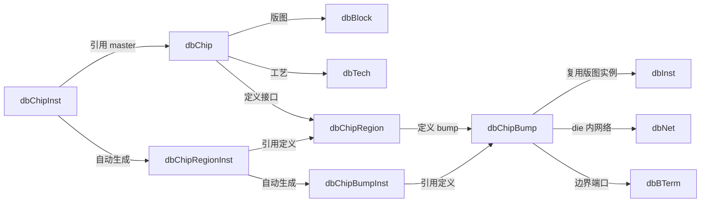
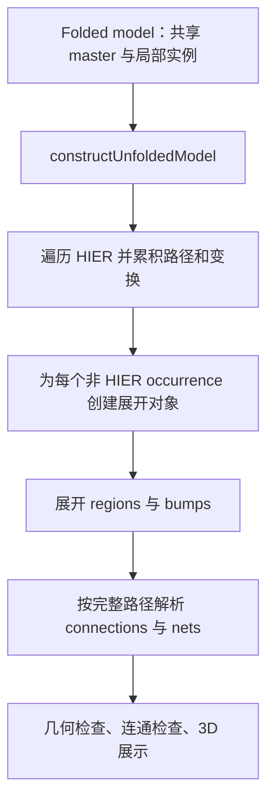

# OpenDB 3DIC Data Model 中文学习笔记

本文以 [3D-IC Support in OpenROAD ODB](../../../src/odb/doc/3dic.md) 为主线，解释模型的设计动机、对象关系和使用方式，并核对当前工作区源码（基于提交 `dc22f8e20e`）。原文与实现存在差异的地方会单独说明。

理解这套模型的关键，是区分三个问题：**一种芯片如何定义、它在装配中如何实例化、它在整个系统中实际出现在哪里**。对应的三层分别是 master、folded instance 和 unfolded occurrence。

## 1. 为什么在传统 2D 模型之上增加 chip 层

传统 ODB 的 `dbBlock` 已经能保存单个 die 内的单元、网络和布线，但多芯片系统还需要表达：

- 同一种 die 放置多次，共享版图定义。
- 不同工艺节点的 die 共存。
- 芯片沿 Z 方向堆叠、翻面，并组成可复用的层次化组件。
- 哪些表面互相键合，以及哪些 bump 在逻辑上属于同一个网络。

ODB 因此在原有 block 层之上增加 chip 层。die 内仍使用 `dbBlock`、`dbInst`、`dbNet`；chip 层描述装配关系，并通过 bump 接回 die 内部对象。这样既能复用已有的版图表示，也能单独分析系统级连接。

| 观察尺度 | 定义 | 实例或连接对象 |
| --- | --- | --- |
| die 内部单元 | `dbMaster` | `dbInst`、`dbITerm`、`dbNet` |
| 系统中的芯片 | `dbChip` | `dbChipInst`、`dbChipBumpInst`、`dbChipNet` |

这是抽象方式上的类比，各类的 API 和所有权规则并非完全相同。

## 2. 用原文的系统例子建立层次感

```text
top_design [HIER]
├── cpu_inst → cpu_complex [HIER]
│   ├── compute_inst → compute_tile [DIE, 5 nm]
│   └── cache_inst   → cache_die    [DIE, 12 nm]
├── mem_inst_0      → mem_chip     [DIE, 12 nm]
├── mem_inst_1      → mem_chip     [同一个 master]
└── interposer_inst → interposer   [DIE, 65 nm]
```

箭头左侧是实例名，右侧是 master 名。`top_design` 本身是顶层 `dbChip`，并不是一个 `dbChipInst`。

这个例子有 **6 个 chip master**：4 个 `DIE`、2 个 `HIER`；实际装配后有 **5 个物理 die occurrence**。两个 memory 共用一个 `mem_chip` 和一份版图，`cpu_complex` 则只负责组合，并不增加一片实体 die。按原文配置，这些实体 die 的定义关联 3 种 `dbTech`。

数量差异正是引入 master/instance 分离的原因：芯片类型数量、层次实例数量和实体 die 数量是不同的统计口径。

## 3. 三组 master/instance：从芯片到接口



图中的连线表达语义上的包含或引用；不应据此推断所有对象的底层存储表都位于父对象中。例如，多个 chip 实例相关的表实际放在 `dbDatabase` 中。

### 3.1 `dbChip`：芯片类型及其固有属性

`dbChip` 由 `dbDatabase` 拥有，保存一种芯片的定义。

| `ChipType` | 用途 |
| --- | --- |
| `DIE` | 普通裸片 |
| `RDL` | 重布线层 |
| `IP` | 硬 IP |
| `SUBSTRATE` | 封装基板 |
| `HIER` | 组合其他芯片的层次容器，没有自己的版图 |

它描述宽、高、厚度、offset、shrink，以及 seal ring、scribe line 和 TSV 标志等固有属性。`getCuboid()` 提供芯片定义的三维包围体；装配位置则放在实例上。

两个关联尤其重要：`getBlock()` 接到传统 2D 版图，`getTech()` 接到该芯片使用的工艺。工艺是逐 chip 引用的，因此系统可以混合多个工艺节点；采用同一工艺的芯片也可以引用同一个技术对象。

### 3.2 `dbChipInst`：在某个父作用域内放置 master

实例需要区分 `getParentChip()` 与 `getMasterChip()`：前者是放在哪里，后者是放什么。

```cpp
// 片段示意：top_design 和 mem_chip 已创建，单位采用数据库坐标单位。
auto* inst = odb::dbChipInst::create(top_design, mem_chip, "mem_inst_0");
inst->setOrient(odb::dbOrientType3D("R0"));
inst->setLoc(odb::Point3D(1000, 500, 0));
```

原文将 parent 描述为“通常是 HIER”；当前 [`dbChipInst::create()`](../../../src/odb/src/db/dbChipInst.cpp) 的实际约束更强：**parent 必须是 `HIER`**，否则报错。

朝向由二维旋转/镜像加可选的 Z 镜像组成，用来表示芯片翻面，不是任意三维欧拉角旋转。局部变换相对于父 chip；深层实例的系统坐标需要沿路径累积变换。

还有一个容易忽略的 API 细节：当前 `setLoc()` 设置的是变换后包围体的最小角位置，并据此计算内部平移量；它不一定等于 `getTransform()` 中的平移原点。`setOrient()` 不会重新计算这个平移量，所以按目标朝向定位时宜先设朝向，再设位置。

顶层通过 `dbDatabase::setTopChip()` 注册，通过 `getChip()` 取得；其他 master 仍保存在数据库中。

### 3.3 `dbChipRegion`：芯片表面的键合区域

region 描述“这片芯片的哪一块区域可以参与接口连接”，包括名称、矩形 footprint、可选的 `dbTechLayer` 和所在侧面。

| `Side` | 相对芯片自身的含义 |
| --- | --- |
| `FRONT` | 正面，即 BEOL 一侧 |
| `BACK` | 背面 |
| `INTERNAL` | 芯片内部 |
| `INTERNAL_EXT` | 位于内部，但允许从外部连接 |

这里的正面/背面是定义坐标系中的语义。芯片翻面后，`FRONT` 可能位于系统坐标系的下侧，不能直接将 `FRONT` 当作世界空间的“上”。

### 3.4 `dbChipBump`：把 chip 层接到真实版图

bump 位于 region 内，并包装 die 的 `dbBlock` 中一个实际放置的 `dbInst`。该实例的 `dbMaster` 提供 bump cell 的几何和引脚，因而无需另造一套 cell 表示。

```text
dbChipBumpInst
  └── getChipBump() → dbChipBump
                        ├── getInst()  → bump cell 的 dbInst
                        ├── getNet()   → die 内部的 dbNet
                        └── getBTerm() → 对外的 dbBTerm
```

`dbChipBump` 关联哪条内部 net、暴露哪个边界端口，是跨层分析的入口。不要仅凭创建了 bump 包装对象，就假设内部电气连接也已经全部建立。

### 3.5 region/bump 为什么还需要实例层

创建 `dbChipInst` 时，ODB 遍历 master 的 region 和 bump，自动生成 `dbChipRegionInst`、`dbChipBumpInst`。使用者通过 chip 实例查找它们，无需显式创建。

因此，`mem_inst_0` 和 `mem_inst_1` 有各自的 region/bump 实例，但这些实例引用相同的 master 定义。修改共享 master 的版图会影响所有使用它的 occurrence；修改某个 chip 实例的位置则只改变该实例的装配变换。

这也提示一个自然的构建顺序：先完成 master 的接口定义，再创建 chip 实例。自动实例化发生于 `dbChipInst::create()`；不能将它理解成对后续所有 master 修改的通用自动同步承诺。

## 4. 为什么连通模型既有 `dbChipConn` 又有 `dbChipNet`

物理键合和逻辑连线回答的是不同问题。

| 对象 | 端点 | 表达的事实 |
| --- | --- | --- |
| `dbChipConn` | region 实例及其路径 | 两个接口区域之间的物理键合关系 |
| `dbChipNet` | bump 实例及其路径 | 哪些 bump 属于同一个系统级逻辑网络 |
| die 内 `dbNet` | block 内端口/引脚 | 信号在单片 die 内如何连接 |

`dbChipConn` 的 thickness 表示键合层的物理间隙。它声明接口关系，但并不自动证明两侧每个 bump 都已对齐、网络都接对；这些需要 checker 结合几何和逻辑信息验证。

同样，两个 bump 进入同一个 `dbChipNet`，也不意味着它们在空间上已形成有效的键合。

一个系统级信号可以沿以下对象链理解：

```text
die A 内部 dbNet
  ↔ A 的 dbChipBump / dbChipBumpInst
  ↔ 系统级 dbChipNet
  ↔ B 的 dbChipBumpInst / dbChipBump
  ↔ die B 内部 dbNet
```

这条链表示建模关联；完整物理可达性仍要结合 region connection 和检查结果判断。

## 5. 为什么端点还必须携带实例路径

`dbChipConn`、`dbChipNet` 归属于某个 chip 的语义作用域，其端点不是只有一个 region/bump 指针，而是：

```text
端点 =（从所属作用域出发的 dbChipInst 路径，region/bump 实例）
```

例如，定义在 `top_design` 的 net 访问 compute 的 bump，需要路径 `{cpu_inst, compute_inst}`；访问 interposer 则只需要 `{interposer_inst}`。

原文在解释路径必要性时，对 memory region 实例的描述略显绕。更准确的区分是：

- 两个直接创建的 `mem_inst_0`、`mem_inst_1` 本来就有不同的 region/bump 实例。
- **复用一个 `HIER` master 时，其内部的 chip 实例对象也会被复用。** 这时只持有内部 region/bump 实例指针，无法区分它经过哪个外层实例出现。

将原例稍作扩展，若 `cpu_complex` 被实例化两次：

```text
cpu_inst_0 → cpu_complex → compute_inst → bump_a
cpu_inst_1 → cpu_complex → compute_inst → bump_a
```

两条路径末端引用的 folded `compute_inst` 和 `bump_a` 对象相同，物理上却是两次不同的出现。完整路径提供了上下文身份。因此，展开后的 occurrence 是树形的，而存储的 master 引用结构包含共享，不能直接当作完全复制的实例树。

另外，原文展示路径时加入 `top_design /` 方便阅读；当前 builder 生成的名称只拼接实例名，例如 `cpu_inst/compute_inst`，并不包含顶层 master 名。调用按路径名查找的 API 时要留意这一区别。

`dbChipPath` 则是另一种对象：它记录信号预期经过的有序 region 条目，每项包含实例路径、region 实例和 `negated` 标志。否定条目表示连接应避开该 region，供连通性检查使用；它不是单纯封装实例路径的工具类，也不是实际布线几何。

## 6. Unfolded view：从共享定义得到全局物理视图

folded 模型便于共享和保存，几何检查则需要知道每片实体 die 的绝对位置。`dbDatabase::constructUnfoldedModel()` 为此构造派生的展开视图。



在概念上，局部点到世界坐标的转换是：

```text
p_world = T_outer(T_inner(p_local))
```

有旋转或镜像时，不能简单相加各层 location。具体组合由 `dbTransform` 完成。

| 展开类 | 提供的系统级信息 |
| --- | --- |
| `dbUnfoldedChipInst` | 完整实例路径、累积变换、三维包围体 |
| `dbUnfoldedChipRegionInst` | 有效朝向、表面 Z、区域包围体 |
| `dbUnfoldedChipBumpInst` | bump 的全局位置 |
| `dbUnfoldedChipConn` | 解析后的两侧 region occurrence |
| `dbUnfoldedChipNet` | 解析后的 bump occurrence 集合 |

原例展开后会得到 compute、cache、两片 memory 和 interposer，共 5 个叶子。`cpu_complex` 不再单独占据实体 die 条目，但仍保留为路径中的层次上下文。

展开时还会解析朝向语义：未发生 Z 镜像时，`FRONT` 对应 `TOP`、`BACK` 对应 `BOTTOM`；累积变换包含 Z 镜像时二者交换。内部区域保持其内部侧面类型。

使用这一视图时应记住：

- 它保留回到 folded 对象的引用，便于从全局检查结果追到源定义。
- 它是派生数据，应修改 folded 源模型后重新构建，而不是把展开对象作为设计输入修改。
- 当前 builder 先清空展开表再重建，因此不要跨重建保存并继续使用旧展开对象指针。
- 它不写入 `.odb`。当前数据库读入路径在 chip 数量大于 1 时会调用重建；手工构造或修改模型后的分析也应确保视图已刷新。

这些行为可直接从 [`dbUnfoldedBuilder.cpp`](../../../src/odb/src/db/dbUnfoldedBuilder.cpp) 和 [`dbDatabase.cpp`](../../../src/odb/src/db/dbDatabase.cpp) 追踪。

## 7. 3DBlox 是模型的输入方式

3DBlox 文件负责把定义和装配信息带入数据库；ODB 对象模型也能直接通过 API 构建，并不依赖文件格式才能成立。

| 输入 | 主要内容 | 对应对象 |
| --- | --- | --- |
| `.3dbv` 的 `ChipletDef` | 类型、尺寸等定义 | `dbChip`，以及相应版图 `dbBlock` |
| `regions` | 接口区域 | `dbChipRegion` |
| `.bmap` | bump map | bump cell `dbInst` 与 `dbChipBump` |
| `APR_tech_file` | 工艺数据 | `dbTech` |
| `.3dbx` 的 `Design` | 顶层装配 | 顶层 `HIER` chip |
| `ChipletInst`、`Stack` | 实例、位置、朝向 | `dbChipInst` |
| `Connection` | 物理接口连接 | `dbChipConn` |
| 外部 Verilog | 系统级逻辑连线 | `dbChipNet` |

典型的理解顺序是“读定义 → 建实例与堆叠 → 建物理/逻辑关系 → 展开 → 检查”。相关 Tcl 入口包括 `read_3dbv`、`read_3dbx`、`read_3dblox_bmap`、`write_3dbv`、`write_3dbx` 和 `check_3dblox`；具体选项及输入依赖应以对应命令实现为准。

无论通过文件还是 API 建模，持久化的源模型最终都使用标准 `.odb` 读写路径保存。

## 8. Checker 如何体现模型的分工

[`Checker`](../../../src/odb/src/3dblox/checker.h) 基于展开模型检查整个装配系统。

| 检查方向 | 需要理解的模型信息 |
| --- | --- |
| floating chips | 芯片是否连接到堆叠结构 |
| overlapping chips | 实体 die 的全局包围体 |
| connection regions | 键合面是否相向、区域是否重叠 |
| bump physical alignment | 两侧 bump 的全局位置和容差 |
| logical/net connectivity | 路径约束、bump/net 关系及物理可达性 |
| `INTERNAL_EXT` usage | 内部但可从外部访问的区域语义 |
| alignment markers | 对齐标记 cell 的位置与相对朝向 |

`dbAlignmentMarkerRule` 在数据库上保存两种标记 cell master 的配对规则，包括距离容差和允许的相对朝向。检查违规通过标准 `dbMarker` 和 marker category 报告，因此可以复用 GUI 的违规展示能力。

从这一分工可以理解模型为何同时保留几何、物理接口和逻辑网络：只有联合这些信息，才能发现“逻辑上接了线，但实体位置或键合关系不支持这条连接”的问题。

## 9. 原文的跨芯片时序规划与当前实现

原文最后提出，将 block 内寄生参数模型向 chip 层扩展：

| die 内 | chip 层 |
| --- | --- |
| `dbNet` | `dbChipNet` |
| `dbCapNode` | `dbChipCapNode` |
| `dbRSeg` | `dbChipRSeg` |

设计意图是在 chip net 上表达电容节点和电阻段，再通过 bump 接入各 die 的内部网络，使时序路径有机会跨越芯片边界。

**原文“这些类尚未进入数据库”的说法已不符合当前工作区。** 当前源码中：

- [`dbChipCapNode.cpp`](../../../src/odb/src/db/dbChipCapNode.cpp) 已实现节点、电容、bump 实例关联，以及通过 bump 取得 `dbBTerm`。
- [`dbChipRSeg.cpp`](../../../src/odb/src/db/dbChipRSeg.cpp) 已实现电阻段及源/目标节点关联。
- [`dbChip.cpp`](../../../src/odb/src/db/dbChip.cpp) 已包含对应对象表的序列化。
- [`TestChips.cpp`](../../../src/odb/test/cpp/TestChips.cpp) 已包含创建、非法参数及数据库读写等测试。

因此，目前可以确认的是“chip 层寄生参数数据结构已经存在”。这并不足以证明完整跨芯片提取、内部网络拼接和 STA 流程已经端到端可用；本文未对该流程进行验证。

## 10. 建议的源码阅读路线与自测

先读接口，再围绕一次实例化和一次展开追踪数据流：

1. [`db.h`](../../../src/odb/include/odb/db.h)：查找 `dbChip`、`dbChipInst`、`dbChipRegion`、`dbChipBump` 及各 unfolded 类的公开接口。
2. [`dbChipInst.cpp`](../../../src/odb/src/db/dbChipInst.cpp)：看 parent/master 关联、region/bump 自动实例化和位置变换。
3. [`dbChipConn.cpp`](../../../src/odb/src/db/dbChipConn.cpp)、[`dbChipNet.cpp`](../../../src/odb/src/db/dbChipNet.cpp)：看作用域和端点路径怎样保存。
4. [`dbUnfoldedBuilder.cpp`](../../../src/odb/src/db/dbUnfoldedBuilder.cpp)：看共享对象如何沿路径转换成各自独立的 occurrence。
5. [`chip schema`](../../../src/odb/src/codeGenerator/schema/chip/)：核对持久化字段；再读 [`3dblox`](../../../src/odb/src/3dblox/) 的导入与检查实现。

已有配套笔记可继续参考：[3DBlox 对象关系](3Dblox/odb_objects.zh.md) 和 [`read_3dbx` 流程](3Dblox/read_3dbx_flow.zh.md)。不同笔记可能对应不同实现阶段，类名和功能状态以当前源码为准。

读完后，可以用下面几个问题检查是否抓住设计边界：

| 问题 | 应有的判断 |
| --- | --- |
| 两片相同 memory 是否需要两份 `dbBlock`？ | 不需要；两次 chip 实例化共享 master 版图。 |
| 两片 memory 的 bump 能否分别连接不同 chip net？ | 可以；端点使用各自 bump 实例及其路径。 |
| 有 `dbChipConn` 是否就能断言电气连接正确？ | 不能；还需验证 bump 对齐和逻辑网络等信息。 |
| folded bump 实例指针能否总是唯一定位物理 bump？ | 不能；复用 HIER master 时还需要完整路径。 |
| `FRONT` 是否总在系统上方？ | 否；有效侧面取决于累积的 Z 镜像。 |
| 修改堆叠位置后能否继续依赖旧 unfolded 结果？ | 应重建派生视图，再使用新的展开对象。 |
| 寄生参数类存在是否意味着跨芯片 STA 已完整可用？ | 不能据此推断；还需要验证整个分析流程。 |
