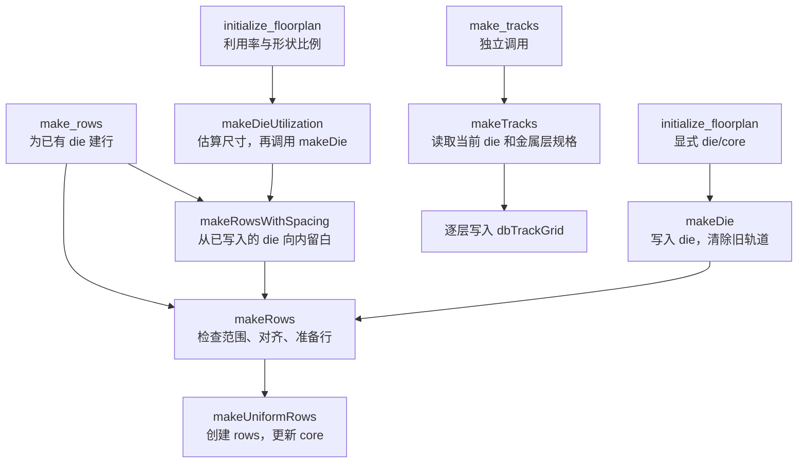

# IFP 基础引擎笔记：从 die/core 到放置行和布线轨道

IFP 把设计尺寸、工艺库规格和用户给定的规划条件，转化为 OpenDB 中的物理基础数据。理解它的基础逻辑，可以沿着三步走：**确定 die/core 范围，生成放置行，再生成布线轨道。**

本文采用矩形 die/core、单一基础 site 和普通等间距轨道，重点解释 `initialize_floorplan` 的两种输入方式，以及 `make_rows`、`make_tracks` 的主要计算与数据变化。希望先了解模块在整个 OpenROAD 中的位置，可以阅读 [IFP 模块总览](ifp-overview.md)。

## 1. 引擎在处理什么数据

逻辑网表告诉工具有哪些单元、引脚怎样连接；LEF 库告诉工具单元有多大、放置网格和金属层采用什么规格。IFP 结合这些信息，为后续布局布线准备空间规则。

| 对象 | 含义 | 与引擎的关系 |
| --- | --- | --- |
| Die | 当前设计块的外边界 | IFP 设置其尺寸和位置 |
| Core | die 内用于安排核心电路的区域 | 是生成标准单元行的范围输入 |
| Site / `dbSite` | 库定义的放置基本单位，包含宽度和高度 | IFP 使用已有 site 定义；单元可以横跨多个 site |
| Row / `dbRow` | 按 site 规格排列的一行放置位置 | IFP 创建 row，后续布局工具再安排单元落位 |
| Track grid / `dbTrackGrid` | 某个金属层上的轨道坐标模式 | IFP 创建轨道模式，后续布线工具再决定网络的具体连线 |

这些对象通过 OpenDB 中的当前设计块 `dbBlock` 联系起来。IFP 直接更新数据库，后续模块可以继续读取它；`write_def`、`write_db` 是按需保存结果的独立步骤。

需要先区分三个尺度：**DBU 是存储长度的单位，site 是放置的离散规格，track pitch 是轨道之间的距离。** 脚本中的几何长度以微米输入，进入主要 C++ 接口时已经转换为整数 DBU。比如本文使用的 Nangate45 数据中，1 µm = 2000 DBU，site 宽高为 0.19 µm × 1.4 µm，即 380 × 2800 DBU。

## 2. 两种初始化方式如何汇合

`initialize_floorplan` 完成建 die 和建 rows。用户可以直接给出 die/core 坐标，也可以让工具先按面积与利用率估算尺寸；两条路径最终使用相同的普通行生成逻辑。



图中的 `make_rows` 根据输入选择路径：给 `-core_area` 时进入 `makeRows`，给 `-core_space` 时先进入 `makeRowsWithSpacing`。两个参数在一次调用中择一使用。

阅读源码时，只需先掌握三层分工：[InitFloorplan.tcl](../src/InitFloorplan.tcl) 选择输入路径、处理必要校验和单位转换；[InitFloorplan.i](../src/InitFloorplan.i) 将参数转交给当前设计的 C++ 对象；[InitFloorplan.cc](../src/InitFloorplan.cc) 完成几何计算和 OpenDB 修改。

当前 Tcl 初始化入口依次调用建 die 和建 rows 的包装接口。C++ 类也提供组合式的 `initFloorplan` 重载，内部同样复用这些引擎函数。跟踪 Tcl 命令时，应从它实际调用的 `makeDie`、`makeDieUtilization` 等函数继续阅读。

## 3. `initialize_floorplan`：确定范围并建行

### 3.1 示例的共同准备

下面使用仓库 [test](../test) 中的 Nangate45 库和小网表 `reg1.v`。以 `src/ifp/test` 为工作目录，在 OpenROAD 中先执行：

```tcl
read_lef Nangate45/Nangate45.lef
read_liberty Nangate45/Nangate45_typ.lib
read_verilog reg1.v
link_design top
set site FreePDK45_38x28_10R_NP_162NW_34O
```

这一步把物理库、单元功能和设计连接准备好。后面两种初始化片段任选一种；比较两者时，分别从新的 OpenROAD 会话开始。

### 3.2 手动指定 die/core

当设计尺寸已由项目或上层模块确定，可以直接指定两个矩形：

```tcl
initialize_floorplan -die_area {0 0 20 20} \
    -core_area {1 1 19 19} \
    -site $site
```

四个坐标依次表示左下角 x、y 和右上角 x、y。这个例子给出 20 µm × 20 µm 的 die，并请求四周各留 1 µm 的 core。

引擎执行的主要逻辑为：

1. `makeDie` 将 die 的坐标对齐到工艺库的制造网格，调用 `block_->setDieArea(...)` 写入边界，并清除已有 track grids。
2. `makeRows` 检查 die 已有非零面积、die 包含 core，并对单元尺寸做基础检查。
3. 根据 site 对齐并生成 rows，再依据生成的行更新数据库中的 core。

因此，即使用户显式给出了 core，其坐标也仍需适应放置网格。本例最终得到 **12 行，每行 94 个 site**；行覆盖的 core 范围为 `(1.14, 1.40)` 到 `(19.00, 18.20)` µm。第 4 节会解释这些数字的来历。

这条路径的面积来自用户指定的范围。基础尺寸检查不能代替后续布局对全部单元位置的安排。

### 3.3 根据利用率和形状比例估算

当设计尺寸尚未确定，可以根据当前实例面积估算初始空间：

```tcl
initialize_floorplan -utilization 30 \
    -aspect_ratio 0.5 \
    -core_space 1 \
    -site $site
```

`-utilization 30` 表示用于估算的面积占比为 30%；`-aspect_ratio 0.5` 表示 **高度 / 宽度 = 0.5**，即高度约为宽度的一半。未指定比例时默认是 1.0。`-core_space 1` 表示四周各留 1 µm；分别指定四个留白时，顺序为 `{bottom top left right}`。

`makeDieUtilization` 的核心计算可以写成：

```text
A = Σ(每个实例所引用的物理单元宽度 × 高度)
u = utilization / 100
r = aspect_ratio

估算 core 面积 = A / u
估算 core 宽度 W = sqrt((A / u) / r)
估算 core 高度 H = W × r

die 左下角 = (0, 0)
die 右上角 = (left + W + right, bottom + H + top)
```

这里的面积由 `designArea()` 累加实例的 `dbMaster` 宽高得到，单位在 C++ 中是 DBU²。它使用物理尺寸，不读取 Liberty 的面积数值。若当前设计中有宏单元实例，其物理面积也会计入。

尺寸估算完成后，流程先通过 `makeDie` 写入 die，再由 `makeRowsWithSpacing` 从**已经写入的 die**向内扣除四周留白，最后调用 `makeRows`。这意味着自动计算出的尺寸还会经过 DBU 整数取整、制造网格对齐和 site 对齐。

在本例中，5 个实例的面积合计 15.428 µm²。按 30% 估算，core 面积约为 51.427 µm²，理想宽高约为 10.142 µm × 5.071 µm。经过对齐和建行后，实际结果为：

| 观察项 | 结果 |
| --- | --- |
| Die 范围 | `(0, 0)` 到 `(12.14, 7.07)` µm |
| Row 数量 | 3 行，每行 52 个 site |
| 行覆盖的 core 范围 | `(1.14, 1.40)` 到 `(11.02, 5.60)` µm |
| 行覆盖面积 | 41.496 µm² |
| 实例面积 / 行覆盖面积 | 约 37.2% |

可以在现有回归的 [init_floorplan2.ok](../test/init_floorplan2.ok) 和 [init_floorplan2.defok](../test/init_floorplan2.defok) 中对照这些结果。目标 30% 与结果约 37.2% 的差别，来自这个小设计中完整行和完整 site 对可用空间的收缩。这个参数用于给出初始规划规模，后续拥塞和时序仍需通过布局布线评估。

手动坐标与利用率估算是两套可选输入。在一个初始化调用中选定一套即可，例如 `-die_area`、`-core_area` 与 `-utilization` 存在互斥限制。

## 4. `make_rows`：把连续范围转成离散放置位置

### 4.1 与初始化共享同一套建行逻辑

`make_rows` 的典型用途是：已经读入带有 die 边界的 DEF，但需要补建标准单元行。它也可以重建已有行。以下两种写法分别给出 core 范围，或从当前 die 扣除留白：

```tcl
make_rows -core_area {1 1 19 19} -site $site
```

```tcl
make_rows -core_space 1 -site $site
```

对于前面的 `(0, 0)` 到 `(20, 20)` µm die，两种写法请求相同的 core。若 die 原点不在 `(0, 0)`，留白仍然是相对于当前 die 的四条边计算：

```text
core 左下角 = (die.xMin + left,  die.yMin + bottom)
core 右上角 = (die.xMax - right, die.yMax - top)
```

`makeRowsWithSpacing` 负责这一步坐标换算，然后复用 `makeRows`。`make_rows` 本身保留 die 和已有轨道，原来的 row 对象则会被删除并重新创建。

### 4.2 普通行怎样生成

在本文的单一 site 场景中，`makeRows` 准备 site、清除旧行后，先把 core 左下角向右、向上对齐到 site 宽高的整数倍。`makeUniformRows` 再计算可容纳的完整 site 数和行数：

```text
sx、sy = site 的宽度、高度
x0 = ceil(core.xMin / sx) × sx
y0 = ceil(core.yMin / sy) × sy

每行 site 数 Nx = floor((core.xMax - x0) / sx)
行数 Ny = floor((core.yMax - y0) / sy)

第 j 行起点 = (x0, y0 + j × sy)，j 从 0 开始
```

`ceil` 表示向上取整，`floor` 表示向下取整。前者让行起点落在网格上，后者保证只放入完整的 site 和行。实现使用整数 DBU 进行这些计算。

代入手动初始化例子的 core `{1 1 19 19}` 和 site 宽高 `0.19 × 1.4` µm：

```text
x0 = ceil(1 / 0.19) × 0.19 = 1.14 µm
y0 = ceil(1 / 1.4) × 1.4 = 1.40 µm
Nx = floor((19 - 1.14) / 0.19) = 94
Ny = floor((19 - 1.40) / 1.4) = 12
```

每行通过 `dbRow::create(...)` 写入 site、起点、朝向、site 数量和步长。默认普通行的朝向按 `N`、`FS` 交替，其中 `FS` 对应上下镜像，便于标准单元相邻行的电源轨衔接。创建 row 的动作定义了放置位置，真实单元的放置由后续布局步骤完成。

`makeUniformRows` 随后通过 `computeCoreArea()` 和 `setCoreArea(...)` 更新 core。因此，本例的行覆盖右上角为 `(1.14 + 94 × 0.19, 1.40 + 12 × 1.4)`，即 `(19.00, 18.20)` µm。以上计算假定矩形区域没有额外禁放区；存在禁放区时，后续行裁剪还会改变有效放置空间。

## 5. `make_tracks`：把层规则转成轨道坐标

### 5.1 从哪里取得 pitch 和 offset

初始化之后执行：

```tcl
make_tracks
```

不指定层名时，`makeTracks()` 遍历有效 routing layer，读取 LEF 中的 X/Y pitch 和 offset。对于本文的普通轨道路径，缺少有效 pitch 的层会产生提示并跳过。

指定层名时，用户可以覆盖该层的 pitch 和 offset；未覆盖的值继续取自 LEF。例如，下面的片段演示单层覆盖，应在尚未生成轨道的设计上单独体验，数值仅用于观察行为：

```tcl
make_tracks metal1 -x_offset 0.1 -x_pitch 0.2 \
    -y_offset 0.1 -y_pitch 0.2
```

这里需要了解的一点 Tcl 逻辑是：**自定义 pitch/offset 的处理位于指定层名的分支中。** 使用覆盖参数时，要同时写出层名。脚本给出的这些长度以微米表示，传入 C++ 前会转换为 DBU 并按制造网格对齐。

### 5.2 在 die 范围内生成坐标

`makeTracks(layer, ...)` 使用当前 die 的范围。对于一组普通 X 坐标模式，先按以下关系计算：

```text
起点 origin = die.xMin + x_offset
数量 count = floor((die 宽度 - x_offset) / x_pitch) + 1
第 k 个坐标 = origin + k × x_pitch，0 ≤ k < count
```

Y 坐标的计算同理。引擎还结合该层最小线宽检查首尾轨道，避免线的半宽伸出 die；必要时去掉边缘轨道。普通路径中，offset 为 0 时会先按一个 pitch 处理。

这里的 X/Y 表示**坐标变化的轴**：X 模式给出一组固定 x 的竖直轨道，Y 模式给出一组固定 y 的水平轨道。金属层的首选布线方向是另一项属性，不能据此把 X 模式理解成水平线。

在手动初始化的 20 µm × 20 µm die 中，默认 metal1 的 Y offset 为 0.07 µm，pitch 为 0.14 µm：

```text
Y 坐标 = 0.07、0.21、0.35、……、19.95 µm
数量 = floor((20 - 0.07) / 0.14) + 1 = 143
```

其最小线宽为 0.07 µm，首尾轨道的半宽都在边界内，因此保留 143 条。写出的 DEF 中，对应模式为：

```text
TRACKS Y 140 DO 143 STEP 280 LAYER metal1 ;
```

其中 140 DBU 对应 0.07 µm，280 DBU 对应 0.14 µm。数据库用 `dbTrackGrid` 保存这种“起点、数量、步长”模式，布线模块需要时再取得轨道坐标。Track 定义参考位置，具体连线还要结合网络、障碍物和设计规则生成。

## 6. 按数据库变化理解命令顺序

| 命令 | Die | Rows / core | Track grids |
| --- | --- | --- | --- |
| `initialize_floorplan` | 设置边界 | 重建 rows，更新 core | 清除已有网格，需要随后生成 |
| `make_rows` | 使用已有边界 | 重建 rows，更新 core | 保留已有网格 |
| `make_tracks` | 读取已有边界 | 普通轨道路径不修改 rows/core | 找到或创建逐层网格，向其中添加模式 |

`make_tracks` 向已有网格追加模式，重复执行相同命令可能重复保存模式。使用时应确定由哪个步骤负责首次生成轨道，以及重新初始化后何时再次生成。

对于从网表开始的基础流程，将第 3.1 节的共同准备、一种初始化方式，以及下面的收尾片段组合即可：

```tcl
make_tracks
write_def initial.def
write_db initial.odb
```

对于已有 floorplan、仅缺少 rows 的场景，可参考 [make_rows.tcl](../test/make_rows.tcl)：读入库和 DEF 后调用 `make_rows`，再查看结果。生成 rows 和 tracks 后，后续布局、引脚放置和布线模块才继续完成各自的任务。

本文的手动与自动初始化示例已用本地 OpenROAD 执行核对：分别生成 12 行 × 94 site、3 行 × 52 site；默认 `make_tracks` 在 Nangate45 的 10 个布线层上共写出 20 条 X/Y 模式记录。这里的“20 条”是 DEF 中的模式记录数，每条模式可以表示许多轨道。重建行后已有轨道保持，重新初始化后轨道被清除。

## 7. 三类读者的后续学习路径

### 7.1 OpenROAD 工具使用者

先把两种初始化方式各跑一遍，比较日志中的 die/core 范围、row 数量，以及导出 DEF 中的 `DIEAREA`、`ROW`、`TRACKS`。随后保持网表不变，只改变一个参数，例如利用率、形状比例或四周留白，先预测尺寸和行数的变化，再查看结果。

进一步阅读[模块手册](../README.md)和 [init_floorplan1.tcl](../test/init_floorplan1.tcl)、[init_floorplan2.tcl](../test/init_floorplan2.tcl)、[make_tracks1.tcl](../test/make_tracks1.tcl)。学习目标是能够选择合适的输入方式，解释对齐带来的差异，并通过后续布局布线判断规划是否合适。

### 7.2 OpenROAD 其他模块开发者

沿着自己的模块实际使用的数据阅读：需要放置位置，就从 `dbBlock::getRows()` 和 `dbRow` 入手；需要布线坐标，就从 `findTrackGrid(layer)` 和 `dbTrackGrid` 入手。结合 [IFP 对 ODB 的依赖梳理](ifp-odb-dependency.md)、[dbSite 说明](dbSite-explained.md)与 [dbTrackGrid 说明](dbTrackGrid详解.md)，区分库中的规格定义和设计中创建的对象。

重点验证两件事：传递的长度是否处于正确单位，保存的 row/track grid 对象是否会在上游重建时失效。读取 core 时，也应理解它与生成的行覆盖范围之间的关系。学习目标是能写清本模块需要什么数据库状态，以及 IFP 的哪些操作会改变这些前提。

### 7.3 IFP 模块开发者

从 [InitFloorplan.hh](../include/ifp/InitFloorplan.hh) 了解接口，再在 [InitFloorplan.cc](../src/InitFloorplan.cc) 中按以下顺序阅读，每组函数先回答一个问题：

| 顺序 | 函数 | 阅读目标 |
| --- | --- | --- |
| 1 | `designArea`、`makeDieUtilization` | 实例面积怎样转成 die 尺寸？ |
| 2 | `makeDie`、`snapToMfgGrid`、`resetTracks` | 边界如何落到数据库，为什么会清除轨道？ |
| 3 | `makeRowsWithSpacing`、`makeRows`、`makeUniformRows` | core 请求怎样变成离散的 row 对象？ |
| 4 | `makeTracks()`、`makeTracks(layer, ...)` | 层参数怎样变成轨道模式，首尾边界如何检查？ |

需要深入时，可对照[放置行源码解析](make_rows-command-source-analysis.md)和[轨道源码解析](make_tracks-command-source-analysis.md)中的基础路径。涉及用户参数时，再回到 `.tcl` 和 `.i` 确认入口与单位转换。

建议先选一个小例子，手算并核对 die 坐标、row 起点与数量、某层轨道起点与数量。若结果不符，沿“输入 → 计算 → OpenDB 对象 → 导出文件”查找首次出现差异的位置。实现变更的验证可参考仓库[测试指南](../../../docs/agents/testing.md)；新增回归用例需要同时登记到 [test/CMakeLists.txt](../test/CMakeLists.txt) 和 [test/BUILD](../test/BUILD)。
