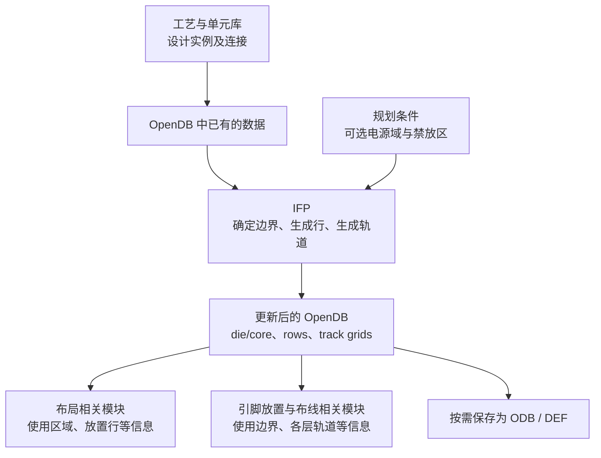

# IFP 模块总览：为布局布线准备空间基础

`ifp` 是 OpenROAD 中负责初始化平面规划（Initialize Floorplan）的模块。它为设计确定 die/core 范围，建立标准单元放置行，并提供生成布线轨道的能力，让后续工具有明确的空间和坐标规则可用。

本文面向刚接触 OpenROAD 的同事。先理解 IFP 解决的问题和它交给下游的数据，再按自己的工作方向深入。文中的行为说明以当前仓库的 [IFP 实现](../src/InitFloorplan.cc)为依据，完整命令参数可查阅[模块手册](../README.md)。

## 1. 为什么需要 IFP

综合后的逻辑网表描述了“有哪些单元、哪些引脚相连”。例如，它能说明一个与门的输出连接到哪个触发器，却没有给出完整的物理安排：设计放在多大的区域里，标准单元按什么格点排列，金属连线可以沿哪些坐标走。

IFP 为这些物理安排建立起点。如果把芯片实现类比为建设厂区，网表像设备和连接清单，IFP 负责确定用地边界、划出设备安装位置的网格，并建立各层管线的参考路径。后续布局工具安排设备位置，布线工具再连接它们。

这一步会影响后面的可行性与实现质量。空间过紧，布局和布线更容易拥挤；空间过大，则可能增加面积和连线长度。IFP 根据给定条件建立初始规划，规划是否合适还需要结合宏单元布局、电源网络、时序和布线结果判断。

## 2. 先认识五个核心概念

| 概念 | 含义 | 初学时应抓住的重点 |
| --- | --- | --- |
| Die：设计外边界 | 当前设计块的物理轮廓；顶层设计中通常对应芯片外框 | 确定整体范围，既可以是矩形，也可以是边与坐标轴平行的多边形 |
| Core：核心区 | 用于安排标准单元、宏单元等核心电路的区域 | 通常位于 die 内部；其中还可能有宏单元、禁放区等，不能把整个面积都当成可放标准单元的空间 |
| Site：放置站点 | 工艺库定义的放置基本单位，包含宽、高及相关属性 | 是网格的规格；一个标准单元通常横跨多个 site，也可能具有多倍行高 |
| Row：放置行 | 按指定 site、起点、方向和数量排出的一行放置位置 | 定义标准单元合法落位的基础，行上此时可以没有任何单元 |
| Track：布线轨道 | 某个金属层上供布线使用的一组参考坐标线 | 规定布线位置；生成 track 后，具体网络仍需由布线工具连接 |

Site 的定义来自 LEF 库，IFP 使用它创建 row。Row 可以理解为按照同一种规格划出的一排位置，多个 row 组成标准单元的放置基础。不同金属层的 track 则位于相应布线层上，与放置行承担不同任务。

脚本中的几何长度通常以微米（µm）输入，核心 C++ 接口使用整数数据库单位（DBU）。数据库单位、制造网格、site 网格和布线轨道各有用途，因此不能把所有“网格”理解成同一套坐标间距。

## 3. 输入是什么，输出交给谁

运行 IFP 前，OpenROAD 通常已将工艺库和设计读入共享数据库 OpenDB（代码中常写作 ODB）。IFP 的核心工作是在这份数据库上读取已有信息、创建或更新物理对象。

| 输入 | 提供的信息 | 何时需要 |
| --- | --- | --- |
| 工艺及单元 LEF | 制造网格、金属层规则、site、单元物理尺寸 | 确定边界对齐方式，生成放置行和轨道，估算设计面积 |
| 已链接的网表，或已有 DEF/ODB 设计 | 单元实例、连接关系，以及可能已有的物理数据 | 网表是新规划的起点；已有物理设计可用于补行等场景 |
| 规划条件 | 显式 die/core 坐标，或利用率、形状比例、core 周边留白，以及选用的 site | 决定空间范围与放置行规格 |
| 按场景提供的补充信息 | Liberty 单元功能、电源意图 UPF、电源域区域、placement blockage（禁放区） | 例如 tiecell 功能识别、多电源域处理和行裁剪 |

Liberty 描述单元逻辑功能和时序等信息，LEF 描述物理尺寸和工艺信息。自动估算面积使用的是实例所引用的物理单元尺寸；tiecell 功能识别则需要对应的 Liberty 信息。



IFP 的主要输出包括 die/core 几何信息、`dbRow` 放置行，以及执行轨道生成后得到的逐层 `dbTrackGrid`。如果调用 tiecell 插入，还会新增实例并更新连接；带有电源意图的行生成也可能通过 UPF 模块引起设计变化。

后续模块可以直接读取同一个 OpenDB。保存文件是流程中的独立步骤：`write_db` 保存数据库快照，`write_def` 导出 DEF 支持的物理设计信息，其中可看到 `DIEAREA`、`ROW`、`TRACKS` 等内容。

## 4. IFP 的三项核心工作

### 4.1 确定空间大小与边界

建立初始规划有两种常见方式。

**边界已知时，直接指定 die 和 core。** 例如，上层设计已经为当前模块分配了一个固定区域，就应以该区域作为输入。矩形之外，当前实现还支持 L 形、T 形等直角多边形规划，需要显式给出相应轮廓。

**边界尚未确定时，从设计面积和目标利用率估算。** 其基本关系为：

```text
设计面积 A = 当前设计中各实例的物理宽度 × 高度之和
目标 core 面积 = A / (利用率百分数 / 100)
core 宽度 = sqrt(目标 core 面积 / 形状比例)
core 高度 = core 宽度 × 形状比例
形状比例 = 高度 / 宽度
```

例如，假设实例总面积为 20,000 µm²，目标利用率为 50%，形状比例为 1，则估算出的 core 为 200 µm × 200 µm。若四周各留 10 µm，理想 die 尺寸就是 220 µm × 220 µm。这里的数值用于说明计算关系，实际设计应根据工艺和下游结果选择参数。

利用率表达的是用于估算空间的目标占比。宏单元也会参与当前实现的实例面积累加，后续新增单元、网格对齐和禁放区又会影响实际可用空间。因此，该估算既不能保证宏单元一定摆得下，也不能保证最终布局密度或布线拥塞满足要求。

### 4.2 在 core 内建立放置行

有了 core 范围，还需要把它转成布局工具能够使用的位置规则。普通行生成主要完成三件事：

1. 从指定的基础 site、设计已用 site 及额外要求的 site 中，确定需要创建哪些行。
2. 按 site 网格对齐起点，放入完整数量的 site 和 row；普通行通常交替采用 `N`、`FS` 朝向，以配合标准单元上下电源轨的衔接。
3. 根据已有电源域和 placement blockage 对行进行调整、分段或裁剪。

朝向影响单元的放置方式，真实的电源连接仍由电源网络相关步骤建立。网格对齐也意味着，输入的 core 坐标和最终行覆盖范围可能存在小幅差异。

多高度单元需要匹配的行规格。有些库还通过 row pattern 定义重复的混合行结构，IFP 为它提供专门的生成路径。多个 site 对应的行可能覆盖同一片空间，不能简单累加所有行面积来计算放置容量。

对于直角多边形 core，IFP 按轮廓生成行段，使行覆盖范围适应凹口等边界。当前多边形行生成不支持 hybrid row pattern；普通矩形 hybrid 行也不支持强制奇偶行数。这类组合限制应在使用相应工艺时再深入了解。

### 4.3 按金属层建立布线轨道

轨道生成读取金属层的节距（pitch）和偏移（offset），在 die 范围内建立一组参考位置。节距决定相邻轨道有多远，偏移决定轨道从哪里开始；需要时也可以按层覆盖默认设置。

IFP 将这些位置以“起点、数量、步长”等模式保存到 `dbTrackGrid`。后续引脚放置、全局布线和详细布线等模块可据此安排引脚或构建布线资源。轨道本身不携带某条逻辑网络的连接结果，也不代表所有沿轨道的位置都没有障碍。

`initialize_floorplan` 会清除已有轨道，轨道需要随后用 `make_tracks` 建立。`make_rows` 会删除旧行并重建；而 `make_tracks` 会向已有网格添加模式。安排脚本时，应把这些数据生命周期纳入考虑。

## 5. 在什么场景中使用

| 场景 | IFP 在其中的作用 | 接下来观察什么 |
| --- | --- | --- |
| 从综合网表开始物理实现 | 估算或设置 die/core，创建行，再建立轨道 | 空间是否合适，行和轨道是否生成，下游布局布线表现如何 |
| 上层已分配固定形状的区域 | 按给定边界建立矩形或直角多边形规划 | core 是否在 die 内，行是否适应区域轮廓 |
| 已有 floorplan DEF，但缺少标准单元行 | 用 `make_rows` 为已有规划补建行 | site 是否匹配，留白和行覆盖范围是否符合预期 |
| 使用多高度单元或混合行工艺库 | 建立相关 site 的行，必要时为后续可能新增的单元预留行类型 | 行规格和单元高度是否兼容 |
| 多电源域，或存在禁放区 | 配合已给定的域区域和 UPF 信息调整行，并裁剪禁放区 | 域内、域间及障碍物附近是否留下预期的放置空间 |
| 网表中有需要常量驱动的网络 | 用 `insert_tiecells` 插入提供逻辑 0 或 1 的 tiecell | 常量网络是否接上对应单元；后续仍需放置并处理扇出需求 |

下面是一个简化使用片段。前提是已经读入 Nangate45 LEF、Liberty 和网表，并完成 `link_design`；site 名必须对应已加载的库。

```tcl
initialize_floorplan -utilization 50 \
    -aspect_ratio 1.0 \
    -core_space 10 \
    -site FreePDK45_38x28_10R_NP_162NW_34O
make_tracks
write_db initial.odb
write_def initial.def
```

运行后，可从日志和 GUI 检查 die/core 范围，从导出的 DEF 查看行和轨道。完整的库、网表加载及结果比对示例可参考 [init_floorplan2.tcl](../test/init_floorplan2.tcl) 和 [make_tracks1.tcl](../test/make_tracks1.tcl)。

## 6. 与其他模块如何分工

IFP 完成的是物理实现的基础准备。一个完整 floorplan 还需要结合宏单元、引脚、电源和后续优化来形成。

| 模块 | 主要工作 | 与 IFP 建立的数据的关系 |
| --- | --- | --- |
| `mpl`：宏单元布局 | 安排 SRAM 等宏单元的位置 | 在已有设计区域内完成宏单元的空间安排 |
| `gpl` / `dpl`：全局布局、详细布局 | 优化标准单元位置，并满足合法放置要求 | 使用 core、rows、site 等信息；IFP 生成行后，单元位置仍需这些步骤确定 |
| `ppl`：引脚放置 | 安排模块输入输出引脚 | 使用设计边界和相关金属层轨道 |
| `pdn`：电源网络生成 | 建立电源环、条带及连接等结构 | 使用已有物理规划；行朝向和域间留白只是准备条件的一部分 |
| `grt` / `drt`：全局布线、详细布线 | 规划网络路径并完成具体连线 | 使用工艺、轨道、障碍物及放置结果等信息 |

对于其他模块开发者，最重要的交接点是 OpenDB 中的几何和对象状态。例如，全局布局在 [placerBase.cpp](../../gpl/src/placerBase.cpp) 中读取 core 和 rows；引脚放置在 [IOPlacer.cpp](../../ppl/src/IOPlacer.cpp) 中读取 track grid。沿着这样的数据读写关系理解模块协作，比从命令注册细节开始更直接。

## 7. 按工作角色继续学习

### 7.1 OpenROAD 工具使用者：能建立规划并判断结果

先阅读[模块手册](../README.md)中边界设置、行和轨道的使用方法，再运行 [init_floorplan1.tcl](../test/init_floorplan1.tcl)、[init_floorplan2.tcl](../test/init_floorplan2.tcl) 和 [make_tracks1.tcl](../test/make_tracks1.tcl)，分别观察显式边界、利用率估算和轨道生成的结果。

建议做一次小实验：保持同一网表和工艺库，只改变利用率，比较 die/core 尺寸及行数，再观察后续布局布线的拥塞、线长和时序变化。这样可以把参数与实际效果联系起来。遇到多高度、多电源域或非矩形设计时，再选择阅读 [multi_height1.tcl](../test/multi_height1.tcl)、[upf_test.tcl](../test/upf_test.tcl) 或 [make_polygon_rows1.tcl](../test/make_polygon_rows1.tcl)。

这一阶段的目标是：能解释参数来源，确认行与轨道已生成，并区分“初始规划完成”和“后续实现质量达到要求”。

### 7.2 OpenROAD 其他模块开发者：理解数据契约与生命周期

从 [IFP 对 ODB 的依赖梳理](ifp-odb-dependency.md)开始，重点认识 `dbBlock`、`dbSite`、`dbRow` 和 `dbTrackGrid`。对照自己模块读取这些对象的位置，明确需要的是边界、有效放置空间，还是特定层上的轨道坐标。

建议做一次数据跟踪：在初始化前、生成行后、生成轨道后分别查看 OpenDB，记录哪些对象被创建或重建。如果下游保存了旧 row 或 track grid 的指针，就要考虑相应重建操作之后的有效性。

还应核对几何语义：`getDieArea()`、`getCoreArea()` 返回矩形包围盒；多边形轮廓有对应的 polygon 接口。带凹口、禁放区或电源域间隙的设计，其包围盒面积无法完整表达可放置容量。可结合 [dbBlock.cpp](../../odb/src/db/dbBlock.cpp) 中的访问接口和实际 rows 理解这一点。

这一阶段的目标是：能写清本模块对 IFP 输出的前置要求，避免混淆单位、几何范围或对象生命周期。

### 7.3 IFP 模块开发者：从主要算法走向特殊场景

先读公开接口 [InitFloorplan.hh](../include/ifp/InitFloorplan.hh)，再围绕 [InitFloorplan.cc](../src/InitFloorplan.cc) 中的主要职责阅读：

| 阅读顺序 | 关键函数 | 要回答的问题 |
| --- | --- | --- |
| 1. 面积与边界 | `designArea`、`makeDieUtilization`、`makeDie` | 面积来自哪里，如何换算尺寸，何时对齐制造网格并清除轨道？ |
| 2. 普通行 | `prepareSitesAndClearRows`、`makeRows`、`makeUniformRows` | site 如何收集，行如何对齐、定向并写入 ODB？ |
| 3. 轨道 | `makeTracks`、`resetTracks` | 每层轨道怎样生成，边界和已有模式如何处理？ |
| 4. 按需扩展 | `makeHybridRows`、`makePolygonRowsScanline`、`updateVoltageDomain`、`insertTiecells` | 工艺或设计条件带来了哪些额外约束与数据库变化？ |

配合[放置行解析](make_rows-command-source-analysis.md)、[轨道解析](make_tracks-command-source-analysis.md)、[dbSite 说明](dbSite-explained.md)和 [dbTrackGrid 说明](dbTrackGrid详解.md)深入。需要调整用户接口时，再阅读 [InitFloorplan.tcl](../src/InitFloorplan.tcl) 及相应 SWIG 绑定，核对参数校验、单位转换和实际调用路径。

动手修改时，从能体现目标行为的最小场景开始：查看 [test](../test) 下对应的 Tcl 脚本，以及作为预期结果的 `.ok` 日志和 `.defok` 文件。理解失败原因后再修改实现，并对照仓库[测试指南](../../../docs/agents/testing.md)验证；新增回归测试需同时登记到 [CMakeLists.txt](../test/CMakeLists.txt) 和 [BUILD](../test/BUILD)。

这一阶段的目标是：能够从输入条件追踪到 ODB 对象变化，用回归结果说明修改为何正确，并评估它对下游布局布线的影响。
